# The Ultimate React Course (2025)

## Section 5 : Working with Components, Props, and JSX

---

## 33. Rendering the Root Component and Strict Mode

```js
// Arquivo ./src/index.js
//React 18+

import React from "react";
import ReactDOM from "react-dom/client";

const App = () => {
  return <h1>Hello React!</h1>;
};

const root = ReactDOM.createRoot(document.getElementById("root"));
root.render(<App />);
```

- "index.js" é utilizado pelo WebPack, como sendo o ponto inicial do projeto. Por isso da necessidade de se criar esse arquivo, com esse nome.

- Os imports no início do arquivo, são as bibliotecas básicas necessárias para o projeto.

- A seguir, tem o componente App, dentro do qual será inserido o código da aplicação. O nome não precisa ser esse, mas o componente deve ser iniciado por letra maiúscula.

- É criada a variável root, a qual recebe a div de id *root* que está em *./public/index.html*. Será dentro dessa div que o React irá renderizar a aplicação.

- Posteriormente, é utilizado o método *render* , para renderizar a aplicação.

- Essa é a forma de renderizar a aplicação para o React 18+.

- No caso do React 17- o código seria:

```js
// Arquivo ./src/index.js

import React from "react";
import ReactDOM from "react-dom";

const App = () => {
  return <h1>Hello React!</h1>;
};

React.render(<App />, document.getElementById("root"));
```

- Ao invés de renderizar o *App* como um root component, pode-se utilizar o *strict mode* , simplesmente envolvendo o *App* em um *strict mode component*. Dessa forma, durante o desenvolvimento, o *strict mode* renderizará o componente duas vezes, a fim de verificar se existem bugs, e verificar se estão utilizadas versões ultrapassadas da

  *React API* .

```js
// Arquivo ./src/index.js
//React 18+

import React from "react";
import ReactDOM from "react-dom/client";

const App = () => {
  return <h1>Hello React!</h1>;
};

const root = ReactDOM.createRoot(document.getElementById("root"));
root.render(
  <React.StrictMode>
    <App />
  </React.StrictMode>
);
```

---

---

## 35 . Components as Building Blocks

- React applications are entirely made out of components.

- React renders a view for each component, and all those views toghther make up the UI.

- Each componente has it's own data, logic and appearence.

- Components can be reused, and nested inside other components.

---

---

## 36. Creating and Reusing a Component

- In React, we create components using functions.

- The function name has to start with an upper case letterr.

- The funciton must return some markup (ussualy in form of a jsx)

  ```react
  function Pizza() {
    return <h2>Pizza</h2>
  }
  ```

- For the component to be displayed in the screen, it should be used inside of the component wich is being redered on the screen.

  ```js
  // Arquivo ./src/index.js

  import React from "react";
  import ReactDOM from "react-dom/client";

  const App = () => {
    return <h1>Hello React!</h1> <Pizza />;
  };

  const root = ReactDOM.createRoot(document.getElementById("root"));
  root.render(
      <App />
  );
  ```

- Each component can only return one element. So, in order to avoid an error, the return of the App component shoul de encapsulated inside of a *div* .

- Once the *Pizza* component is nested inside *App* it will be presented on the screen. Pizza is nested inside of App.

- What should be nested is the component, and not it's declaration.

  ```js
  // Arquivo ./src/index.js

  import React from "react";
  import ReactDOM from "react-dom/client";

  const App = () => {
    return (
      <div>
        <h1>Hello React!</h1>
        <Pizza />
      </div>
    );
  };

  const root = ReactDOM.createRoot(document.getElementById("root"));
  root.render(<App />);
  ```

  - Below, more data is added to the pizza component. This data was copied from the file data.js

  ```typescript
  function Pizza() {
   return <div>
    
    <h2>Pizza Spinachi</h2>
    <p>Tomato, mozarella, spinach, and ricotta cheese</p>
   </div>
  }
  ```

- The most basic (and wrong) way of using a component, is just by manually copying it several times, into the *App*.

  ```typescript
  import React from "react";
  import ReactDOM from "react-dom/client";

  const App = () => {
    return (
      <div>
        <h1>Hello React!</h1>
        <Pizza />
        <Pizza />
        <Pizza />
      </div>
    );
  };
  ```

  ## 37. What is JSX

  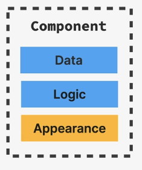

  - JSX is a declarative syntax to describre what components look like and how they work.
  - Every component must return one block of JSX, that React will use to render the compoent in the UI.

  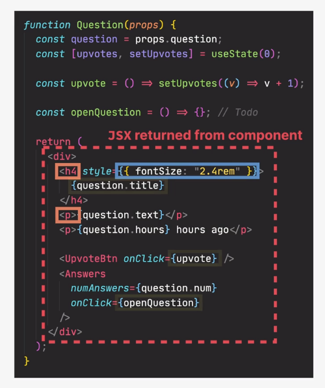

  - JSX is an extension of JavaScript that allows us to embed JS, CSS and React components into HTML.
  - JSX is declarative: it describes what the UI should look like using JSX, based on current data. JSX tells React **what** it should show on screen, and not **how** it should do it.

---

---

## 38. Creating more components

The components for the others structural elements from the page, will be created.

```jsx
//Header
const Header = () => {
  return <h1>Fast React Pizza Co. </h1>;
};
```

```jsx
//Menu
const Menu = () => {
  return (
    <div>
      <h2>Our Menu</h2>
      <Pizza />
      <Pizza />
      <Pizza />
    </div>
  );
};
```

```jsx
//Footer
const Footer = () => {
  return (
    <footer>{new Date().toLocalTimeString()}. We're currently open</footer>
  );
};
```

The *App* will be updated accordingly

```jsx
const App = () => {
  return (
    <div>
      <Header />
      <Menu />
      <Footer />
    </div>
  );
};
```

---

---

## 39. Styling React Applications

In JSX there are several ways of applying style to a component. One of them is
to use the inline style.

```javascript
const Header = () => {
  return <h1 style={{ color: red }}>Fast React Pizza Co.</h1>;
};
```

In JSX, in order to use the inline style it's necessary to pass the style
information inside of a javascript object ( the inner {}). And, to use JS,
is necessary to "enter in JS mode" (the outter {}). All the other style
information will be placed inside of the JS object.

```javascript
const Header = () => {
  return (
    <h1 style={{ color: red, fontSize: "32px", textTransform: "uppercase" }}>
      Fast React Pizza Co.
    </h1>
  );
};
```

Since it is all in a JS object, the style could also be informed like this

```javascript
const Header = () => {
  const style = { color: red, fontSize: "32px", textTransform: "uppercase" };

  return <h1 style={style}>Fast React Pizza Co.</h1>;
};
```

Another option is to use an external css file, define the style into classes,
and use the classe names where necessary. We should not foget to import the
CSS file, prior it's use.

```javascript
import "./index.css"; //just an example
```

---

---

## 42. Passing and receiveing Props

```javascript
const Menu = () => {
  return (
    <main className="menu">
      <h2>Our Menu</h2>
      {/*defining the props, and their value*/}
      <Pizza
        name="Pizza Spinaci"
        ingredients="Tomato,
      mozarella, spinach, and ricotta cheese"
        photoName="pizzas/spinaci.jpg"
        price="10"
      />
    </main>
  );
};

const Pizza = (props) => {
  //receiveing the props in the component
  return (
    <div>
       //using the props
      <h3>{props.name}</h3>
      <p>{props.ingredients}</p>
    </div>
  );
};
```

The props values don't have to be defined on the same order every time

```javascript
<Pizza
  name="Pizza Funghi"
  ingredients="Tomato, mushrooms"
  price="12"
  photoName="pizzas/funghi.jpg"
/>
```

---

---

## 43. Props, Immutability, and One-Way Data Flow

We use props to move data from a parent component to a child component

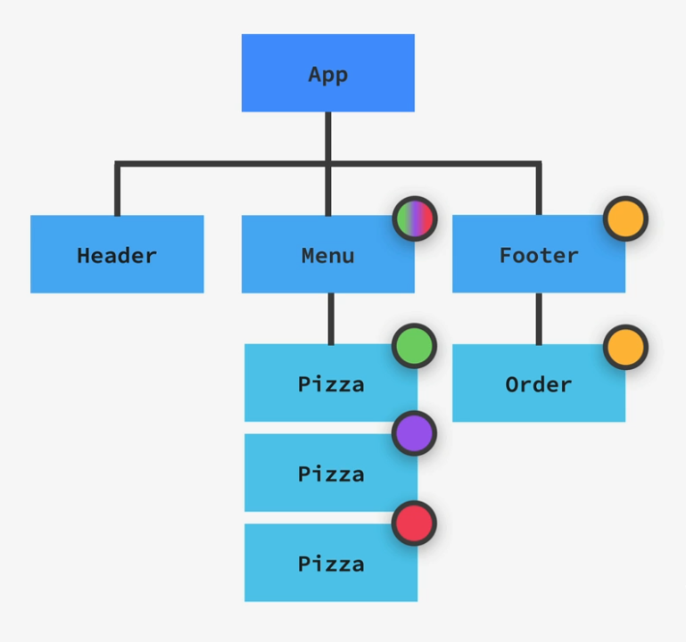;

Props are like arguments passed to a JS function. Single values, arrays,
objects, functions and other components can be passed as props.

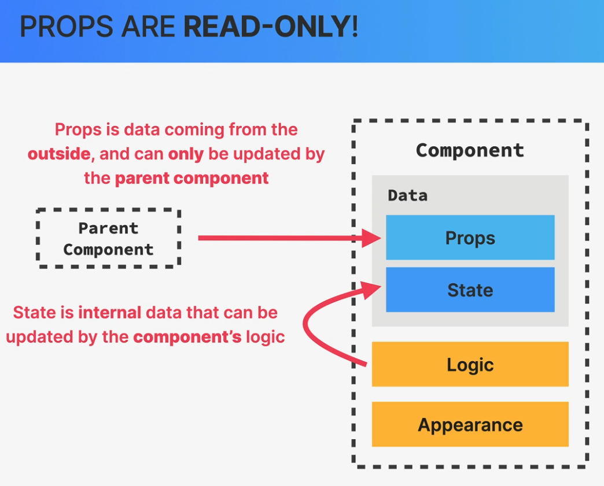;

Props are read only. If you need to mutate props, it has to be done using State.a

Props are basically objects. And when you copy an object, and mutate a copy,
the original object will also be changed, afecting the behaviour of the parent
component, and/ or other child components.

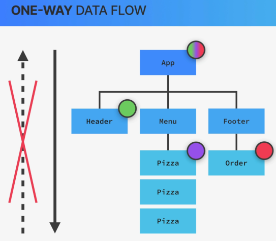;

It makes it easyer to predict the app behaviour, and debugg. Also, it's more
performant than a two way data flow.

---

---

## 44. CHALLENGE #1: Profile Card (v1)

Minha solução

```jsx
import { StrictMode } from "react";
import { createRoot } from "react-dom/client";
import "./styles.css";

function App() {
  return (
    <div className="card">
      <Avatar />
      <div className="data">
        <Intro />
        {/* Should contain one Skill component
        for each web dev skill that you have,
        customized with props */}
        <SkillList />
      </div>
    </div>
  );
}

const Avatar = () => {
  return (
    
  );
};

const Intro = () => {
  return (
    <div>
      <h1>Joelson Junior</h1>
      <p>
        Sou um profissional da área de TI, na qual atuo como desenvolvedor de
        software. Graças a minhas experiências passadas pude desenvolver
        competências que contribuem para minha área de atuação como por exemplo
        gestão de equipes, capacidade de solução de problemas, team building e
        capacidade de adaptação.
      </p>
    </div>
  );
};

const SkillList = () => {
  return (
    <div className="skill-list">
      <Skill skill="Ux" emoji="👶" color="blue" />
      <Skill skill="React" emoji="👶" color="orangered" />
      <Skill skill="C#" emoji="👶" color="purple" />
      <Skill skill="SQL" emoji="👶" color="gray" />
    </div>
  );
};

const Skill = (props) => {
  return (
    <div className="skill" style={{ backgroundColor: props.color }}>
      <span>{props.skill}</span>
      <span>{props.emoji}</span>
    </div>
  );
};

const rootElement = document.getElementById("root");
const root = createRoot(rootElement);

root.render(
  <StrictMode>
    <App />
  </StrictMode>
);
```

---

## 45. The Rules of JSX

---

### General Rules

- Essentialy works like HTML, but we can enter *JavaScript mode* by using {}
- We can place JavaScript expressions inside the {}. Examples: reference
  variables, create arrays or objects, [].map, ternary operator, etc.
- Statements are **not allowed** (if/ else, for, switch);
- JSX produces a JavaScript expression.

  ```javascript
  const el = <h1>Hello React!</h1>

  <!-- generates -->

  const el = React.createElement("h1", null, "Hello React!" );
  ```

- Because of that, we can:
  - place other pieces of JSX inside of the {}
  - write JSX anywhere inside a component ( in if/else, assign to variables,
    pass it to functions).
- A piece of JSX can have **one root element**. If you need more use
  <React.Fragment> (or the short <>

---

---

## 46. Rendering Lists)

In order to render list in React, we use the *map* method. With it we can go
over the data, and create a component to each one of them.

Right now, in order to render all the pizzas, we have to write one component
for each of the pizza items inside of the pizzaData array, and manually fill
the props for each one.

```jsx
const Menu = () => {
  return (
    <main className="menu">
      <h2>Our Menu</h2>
      {/*defining the props, and their value*/}
      <Pizza
        name="Pizza Spinaci"
        ingredients="Tomato,
      mozarella, spinach, and ricotta cheese"
        photoName="pizzas/spinaci.jpg"
        price="10"
      />
    </main>
  );
};

const Pizza = (props) => {
  //receiveing the props in the component
  return (
    <div>
       //using the props
      <h3>{props.name}</h3>
      <p>{props.ingredients}</p>
    </div>
  );
};
```

Using the map method, we ca iterate over the array, and generate (return) one
pizza component for each item of the array.

```jsx
<div>
  {pizzaData.map((pizza) => (
    <Pizza pizzaObject={pizza} key={pizza.name} />
  ))}
</div>
```

We pass the object to the component as a prop, and from inside the component,
retrieve the necessary data.

```jsx
const Pizza = (props) => {
  return (
    <div>
      
      <div>
        <h3>{props.pizzaObject.name}</h3>
        <p>{props.pizzaObject.ingredients}</p>
        <span>{props.pizzaObject.price}</span>
      </div>
    </div>
  );
};
```

As we are rendering a list, the div names should be changed, in order to be
semantically accurate. The final code will look like this:

```jsx
const Menu = () => {
  return (
    <main className="menu">
      <h2>Our Menu</h2>

      <ul className="pizzas">
        {pizzaData.map((pizza) => (
          <Pizza pizzaObject={pizza} key={pizza.name} />
        ))}
      </ul>
    </main>
  );
};

const Pizza = (props) => {
  return (
    <li className="pizza">
      
      <div>
        <h3>{props.pizzaObject.name}</h3>
        <p>{props.pizzaObject.ingredients}</p>
        <span>{props.pizzaObject.price}</span>
      </div>
    </li>
  );
};
```

**Note** : we should use .map, instead of forEach. The reason it that we need to
have *JSX* inside of the ul. Map returns a new array (JSX element).

---

---

## 47 Conditional Rendering with &&

```jsx
const Menu = () => {
  const pizzas = pizzaData;
  const havePizzas = pizzaData.length > 0;

  return (
    <main className="menu">
      <h2>Our Menu</h2>
      {havePizzas && (
        <ul className="pizzas">
          {pizzas.map((pizza) => (
            <Pizza pizzaObject={pizza} key={pizza.name} />
          ))}
        </ul>
      )}
```

---

## 48 Conditional Rendering with Ternaries

```jsx
  const Footer = () => {
  const hour = new Date().getHours();
  const openHour = 10;
  const closeHour = 22;
  const isOpen = hour >= openHour && hour <= closeHour;

  return (
    <footer className="footer">
      {isOpen ? (
        <div className="order">
          <p>We're open until {closeHour}:00. Come visit us, or order online</p>
          <buttton className="btn">Order</buttton>
        </div>
      ) : (
        <p>
          We're happy to welcome you between {openHour}:00 to {closeHour}:00.
        </p>
      )}
    </footer>
  );
};
```

---

## 49 Conditional Rendering with Multiple Returns

```jsx
const Pizza = (props) => {
  if (props.pizzaObject.soldOut) return null;

  return (
    <li className="pizza">
      
      <div>
        <h3>{props.pizzaObject.name}</h3>
        <p>{props.pizzaObject.ingredients}</p>
        <span>{props.pizzaObject.price}</span>
      </div>
    </li>
  );
};
```

---

## 50. Extracting JSX into a new Component

Spliting the Footer component in two separate components, Order and Footer.

```jsx
const Footer = () => {
  const hour = new Date().getHours();

  const businessHours = {
    open: 10,
    close: 13,
  };

  const isOpen = hour >= businessHours.open && hour <= businessHours.close;
return (
    <footer className="footer">
      {isOpen ? (
        <Order hours={businessHours} />
      ) : (
        <p>
          We're happy to welcome you between {businessHours.open}:00 and{" "}
          {businessHours.close}:00.
        </p>
      )}
    </footer>
  );
};

const Order = (props) => {
  return (
    <div className="order">
      <p>
        We're open until {props.hours.close}:00. Come visit us, or order online
      </p>
      <buttton className="btn">Order</buttton>
    </div>
  );
};

```

---

## 51. Destructuring Props

Using destructuring it's easyer to access the values that are passed using props.
The variable used in the destructuring of the props should have the same name of
the props being passed from the parent component.

```jsx

```

---

## 52. React Fragments

React Fragment allow us to group elements, without leaving any trace on the
HTML tree (in the DOM).

```jsx
  return (
    <main className="menu">
      <h2>Our Menu</h2>

      {havePizzas ? (
        <>
          <p>
            Authentic Italian cusine. 6 creative dishes to choose from. All from
            our stone oven, all organic, all delicious.
          </p>
          <ul className="pizzas">
            {pizzas.map((pizza) => (
              <Pizza pizzaObject={pizza} key={pizza.name} />
            ))}
          </ul>
        </>
      ) : (
        <p>We're still working on our menu. Please come back later.</p>
      )}
```

There are two ways of representin a React Fragment

```jsx
  <> </>

  <React.Fragment></React.Fragment>
```

The second way of doing it is usefeul when, for example, we're rendering a list,
and have the nedd to put a key to it.

```jsx
  <React.Fragment key={'my-sample-key'}>
  'some-code-here'
  </React.Fragment>
```

---

## 53. Setting Classes and Text Conditionally

```jsx
  const Pizza = ({ pizzaObject }) => {
  // if (pizzaObject.soldOut) return null;

  return (
    <li className={`pizza ${pizzaObject.soldOut ? "sold-out" : ""}`}>
      
      <div>
        <h3>{pizzaObject.name}</h3>
        <p>{pizzaObject.ingredients}</p>
        <span>{pizzaObject.soldOut ? "SOLD OUT" : pizzaObject.price}</span>
      </div>
    </li>
  );
};
```

---

## 54. Section Summary

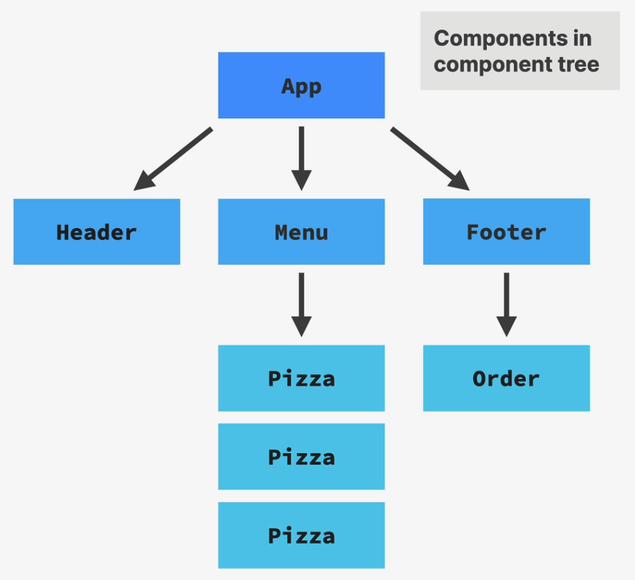

---

## 57. Let's build a Steps Component

---

## 58. Handling Events the React Way

We specify a event listener function directly on the element were it will happen

```jsx
<div className="buttons">
    <div>
      <button
        style={{ backgroundColor: "#7950f2", color: "#FFF" }}
        onClick={() => alert("Previous")}
      >
        Previous
      </button>
    </div>
    <div>
      <button
        style={{ backgroundColor: "#7950f2", color: "#FFF" }}
        onClick={() => alert("Next")}
      >
        Next
      </button>
    </div>
  </div>
```

Event handler functions are written **right inside** the component

```jsx
export default function App() {
  const step = 3;

  const handlePrevious = () => {
    alert("Previous");
  };

  const handleNext = () => {
    alert("Next");
  };

  //The handlers are passed to the onClic, of each button.
  <div className="buttons">
        <div>
          <button
            style={{ backgroundColor: "#7950f2", color: "#FFF" }}
            onClick={handlePrevious}
          >
            Previous
          </button>
        </div>
        <div>
          <button
            style={{ backgroundColor: "#7950f2", color: "#FFF" }}
            onClick={handleNext}
          >
            Next
          </button>
        </div>
      </div>

```

---

## 59. What is State in React

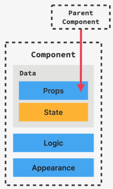

- State is data that a component can hold over time. Necessary for information
that needs to be remenbered throughout the app's lifecycle.
- "Components' memory"
- **"State variable" / "piece of state"**: A single variable in a component
  (component state)
- State refers to the entire state that the component is in (the entire
  condition on a certain point in time). The term *State* refers to all the
  *pieces of state* toghether.
- Updating **component state** triggers *React* to **re-render the component**
- When a single component is rendered, we call it a view. All the views combined
  together make the final *User Interface*

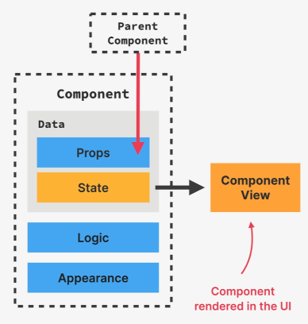

- State is how *React* keeps data in sync with the UI
- State allow developers to:
  - Update the components view(by re-rendering it)
  - Persist local variables between renders

---

## 60. Creating a State Variable With useState

To utilize *State* in *React* we follow 3 basic steps:

- We add a new state variable
- We use it in the code (usually in JSX)
- We update the piece of state in some event handler

```jsx
import {useState} from React;

const arr = useState(1);
```

*useState* returns an array, with two values. The first is the default value of
that state. The second is a function that we can use to update our state
variable.

Usually, we should destruct the return of the useState. Doing so, we concluded
the first two steps necessary to use state.

```jsx
import { useState } from "react";

const messages = [
  "Learn React ⚛️",
  "Apply for jobs 💼",
  "Invest your new income 🤑",
];

export default function App() {
  //implementing State variable
  const [step, setStep] = useState(1);

  const handlePrevious = () => {
    alert("Previous");
  };

  const handleNext = () => {
    alert("Next");
  };

  return (
    <div className="steps">
      <div className="numbers">
      {/* using the State variable */}
        <div className={`${step >= 1 ? "active" : ""}`}>1</div>
        <div className={`${step >= 2 ? "active" : ""}`}>2</div>
        <div className={`${step >= 3 ? "active" : ""}`}>3</div>
      </div>
```

The next step is to update the state variable, using a handler.

```jsx
import { useState } from "react";

const messages = [
  "Learn React ⚛️",
  "Apply for jobs 💼",
  "Invest your new income 🤑",
];

export default function App() {
  const [step, setStep] = useState(1);

  const handlePrevious = () => {
    if (step > 1) setStep(step - 1);
  };

  const handleNext = () => {
    if (step < 3) setStep(step + 1);
  };

  return (
    <div className="steps">
      <div className="numbers">
        <div className={step >= 1 ? "active" : ""}>1</div>
        <div className={step >= 2 ? "active" : ""}>2</div>
        <div className={step >= 3 ? "active" : ""}>3</div>
      </div>
      <p className="message">
        Step {step}: {messages[step - 1]}
      </p>
      <div className="buttons">
        <div>
          <button
            style={{ backgroundColor: "#7950f2", color: "#FFF" }}
            onClick={handlePrevious}
          >
            Previous
          </button>
        </div>
        <div>
          <button
            style={{ backgroundColor: "#7950f2", color: "#FFF" }}
            onClick={handleNext}
          >
            Next
          </button>
        </div>
      </div>
    </div>
  );
}
```

- *useState* is a *React Hook*. All *React* functions that start with *use* are
hooks.
- Hooks can only be used on the top level of a function. Not inside an *if*
statment, functions, loops, etc.
- State should always be updated using the *update function*, and not manually.

---

## 61. Don't Set State Manually

```jsx
export default function App() {
  let [step, setStep] = useState(1);
  let [step, setStep] = useState(1);

  const handlePrevious = () => {
    // if (step > 1) setStep(step - 1);
    step = step +1;
  };
```

If we try to update a state variable manually, *React* won't have a way of
knowing that we're trying to update the state variable. Because of that, noting
happens.

- Always consider *state* in *React* as something immutable, and that can only
  be changed using the tolls provided by the framework.

---

## 62. The Mechanics of State

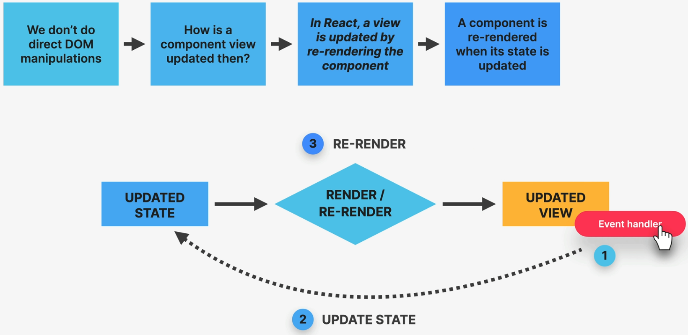

---

## 63. Adding Another Piece of State

```jsx
const handleIsOpen = () => {
    setIsOpen(!isOpen);
  };

  return (
    <>
      <button className="close" onClick={handleIsOpen}>
        &times;
      </button>
      {isOpen && (
        <div className="steps">
          <div className="numbers">
            <div className={step >= 1 ? "active" : ""}>1</div>
            <div className={step >= 2 ? "active" : ""}>2</div>
            <div className={step >= 3 ? "active" : ""}>3</div>
          </div>
          <p className="message">
            Step {step}: {messages[step - 1]}
          </p>
          <div className="buttons">
            <div>
              <button
                style={{ backgroundColor: "#7950f2", color: "#FFF" }}
                onClick={handlePrevious}
              >
                Previous
              </button>
            </div>
            <div>
              <button
                style={{ backgroundColor: "#7950f2", color: "#FFF" }}
                onClick={handleNext}
              >
                Next
              </button>
            </div>
          </div>
        </div>
      )}
    </>
  );
  ```

---

## 64. React Developer Tools

Allow us to inspect the component tree,  and manipulate components, (and it's states and props),
directly from the browser console.

---

## 65. Updating State Based on Current State

Update state, based on current state, in the way we're doing it it's fine, but
it's a fagrile solution.

```jsx
  const [step, setStep] = useState(1);

  const handleNext = () => {
    if (step < 3) setStep(step + 1);
  };
```

If we decide to increase two steps at a time, doing this:

```jsx
  const [step, setStep] = useState(1);

  const handleNext = () => {
    if (step < 3) {
      setStep(step + 1);
      setStep(step + 1);
    };
  };
```

It won't work. It will increase the steps by one.
The correct way of doing it, is to pass a callback function to the set function,
and provide to it the current value of the state.

```jsx
  const [step, setStep] = useState(1);

  const handleNext = () => {
    if (step < 3) {
      setStep((s) => s + 1);
      setStep((s) => s + 1);
    };
  };
```

Even if we're doing it only once, the safer way is to use the callback function,
when we're updating state, based on the current state.

```jsx
const handlePrevious = () => {
    if (step > 1) setStep((s) => s - 1);
  };

  const handleNext = () => {
    if (step < 3) setStep((s) => s + 1);
  };

  const handleIsOpen = () => {
    setIsOpen((is) => !is);
  };

```

There's no need for the callback, if we're not updating a state based on the
current state value.

---

## 66. More Thoughts About State + State Guidelines

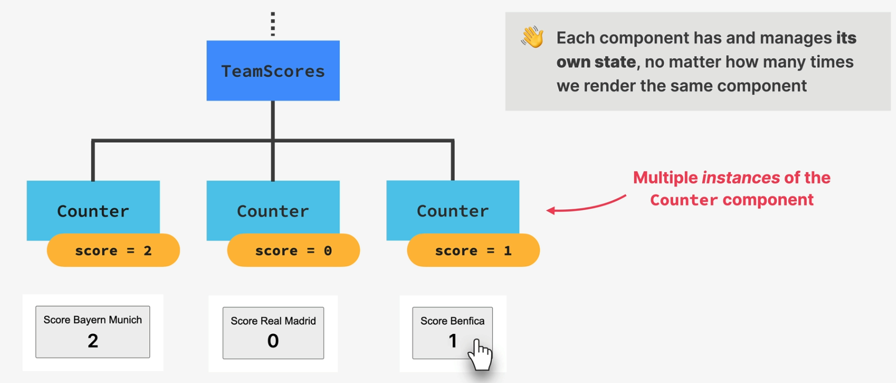

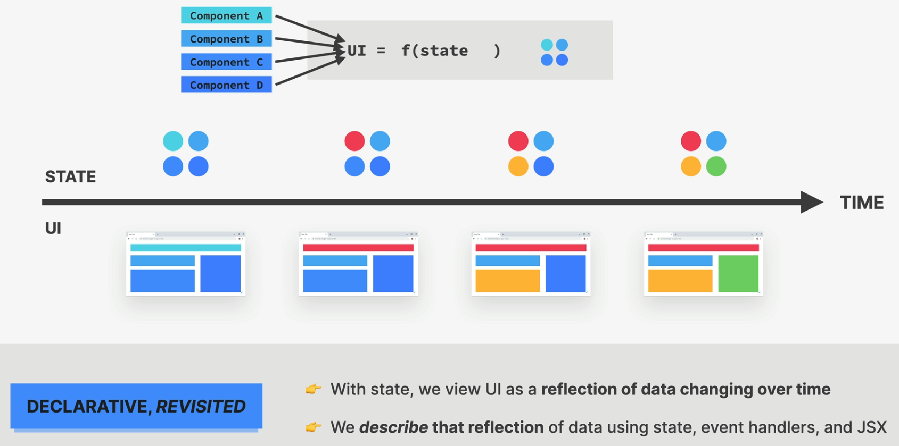

- The UI is a representation of all the states, in all components. It's is
  basically a function of State
- A React application is about changing state over time, and displaying in
  correctly all the time.

### Practical Guidelines about State

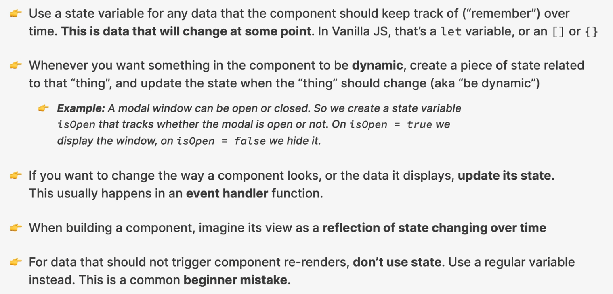

---

## 72. Building a Form and Handling Submissions

To use a *Form* in *React* we use the regular *HTML* form

```jsx
  return (
    <form className="add-form">
      <h3>What do you need for your 😍 trip?</h3>
      <select>
        {Array.from({ length: 20 }, (_, i) => i + 1).map((num) => (
          <option value={num} key={num}>
            {num}
          </option>
        ))}
      </select>
      <input type="text" placeholder="Item..." />
      <button>Add</button>
    </form>
  );
};
```

The following piece of code is using an *Array* method, in order to
create a list of values, that will be passed on to the *map*, so it
can create an opton entry to each of the number in the *Array*

```jsx
      <select>
        {Array.from({ length: 20 }, (_, i) => i + 1).map((num) => (
          <option value={num} key={num}>
            {num}
          </option>
        ))}
      </select>
      <input type="text" 
```

To handle the form submission, we use a function handler, that shoul be
related to the form submit event it self, and not to the submission button.

```jsx
const Form = () => {
  const handleSubmit = () => {
   
  };

  return (
    <form className="add-form" onSubmit={handleSubmit}>
      <h3>What do you need for your 😍 trip?</h3>
      <select>
        {Array.from({ length: 20 }, (_, i) => i + 1).map((num) => (
          <option value={num} key={num}>
            {num}
          </option>
        ))}
      </select>
      <input type="text" placeholder="Item..." />
      <button>Add</button>
    </form>
  );
};
```

When we submit a form, the default HTML behaviour is to reload the page. In
order to keep the SPA flow, we don't want that to happen. So, we have to
pass the submit event to the handler, in order to prevent the default
behaviour. When the *submit* happens, React will pass the event to the
*onSubmit*  property (to the method that we wrote inside it). That event is an object with all the information of
the current event

```jsx
const Form = () => {
  const handleSubmit = (e) => {
    e.preventDefault();
  };

  return (
    <form className="add-form" onSubmit={handleSubmit}>
      <h3>What do you need for your 😍 trip?</h3>
      <select>
        {Array.from({ length: 20 }, (_, i) => i + 1).map((num) => (
          <option value={num} key={num}>
            {num}
          </option>
        ))}
      </select>
      <input type="text" placeholder="Item..." />
      <button>Add</button>
    </form>
  );
};
```

---

## 73. Controlled Elements

By default, the input elements maintain their own state inside the *DOM* (the HTML element itself). In *Reacrt* we like to
keep the *state* all in one place, wich is inside the application, and not inside the *DOM*. In order to do that, we use
a technique calle *controlled elements*. Doing so, is *React* that controls and own the state of the input field.

In order to use the controlled element technique, we follow 3 steps:

- First, we create a state.
- Second, we use that value.
- Third, connect the state with the value that will be typed on the input.

```jsx
const Form = () => {
  const [description, setDescription] = useState(""); //defining the state

  const handleSubmit = (e) => {
    e.preventDefault();
  };

  return (
    <form className="add-form" onSubmit={handleSubmit}>
      <h3>What do you need for your 😍 trip?</h3>
      <select>
        {Array.from({ length: 20 }, (_, i) => i + 1).map((num) => (
          <option value={num} key={num}>
            {num}
          </option>
        ))}
      </select>
      <input
        type="text"
        placeholder="Item..."
        value={description} //using the state value
        onChange={(e) => setDescription(e.target.value)} //connectig the inpute value with the state
      />
```

Controlling both inputs

```jsx
const Form = () => {
  const [description, setDescription] = useState("");
  const [quantity, setQuantity] = useState(1);

  const handleSubmit = (e) => {
    e.preventDefault();
  };

  return (
    <form className="add-form" onSubmit={handleSubmit}>
      <h3>What do you need for your 😍 trip?</h3>
      <select
        value={quantity}
        onChange={(e) => setQuantity(Number(e.target.value))}
      >
        {Array.from({ length: 20 }, (_, i) => i + 1).map((num) => (
          <option value={num} key={num}>
            {num}
          </option>
        ))}
      </select>
      <input
        type="text"
        placeholder="Item..."
        value={description}
        onChange={(e) => setDescription(e.target.value)}
      />
      <button>Add</button>
    </form>
  );
};
```

---

## 74. State vs. Props

| State | Props |
|:----: |:----: |
|Internal data, owned by component | External data, owned by the parent component|
|Component memory | Similar to function parameters |
|Can be update by the component itself | Read only |
|Updating State causes re-render | Receiveing new props, causes re-render. <br> Usually when the parent *State* is updated |
|Used to make components interactive | Used by parent component to configure child <br> component |

---

## 75. EXERCISE #1: Flashcards

---

## 76. CHALLENGE #2: Date Counter (v2)

---

## 78. What is "Thinking in React"?

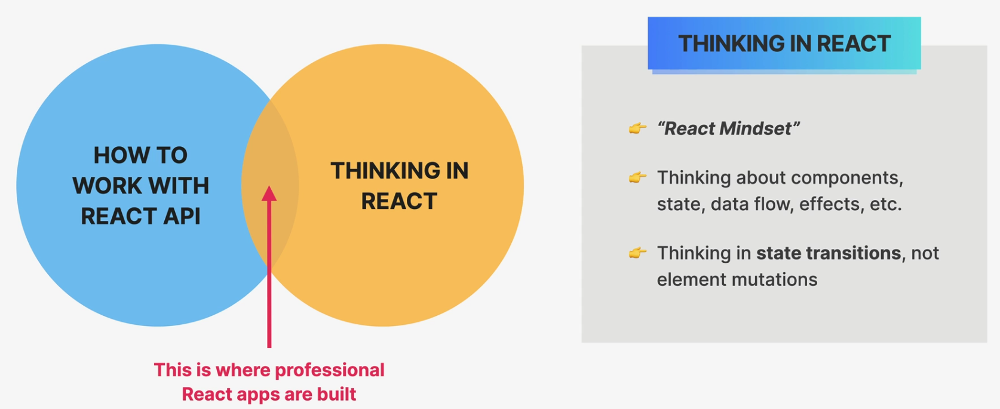

### Thinking in React Process

1. Break the UI into components, and stabilsh the *component tree*
2. Build a static version in *React* (without *State*)
3. Think about *State*:
   1. When to use
   2. Types of *State*: local vs global
   3. Where to place each piece of *State*
4. Estabilish **data flow**:
   1. One-way data flow
   2. Child-to-parent communication
   3. Accessing global *State*

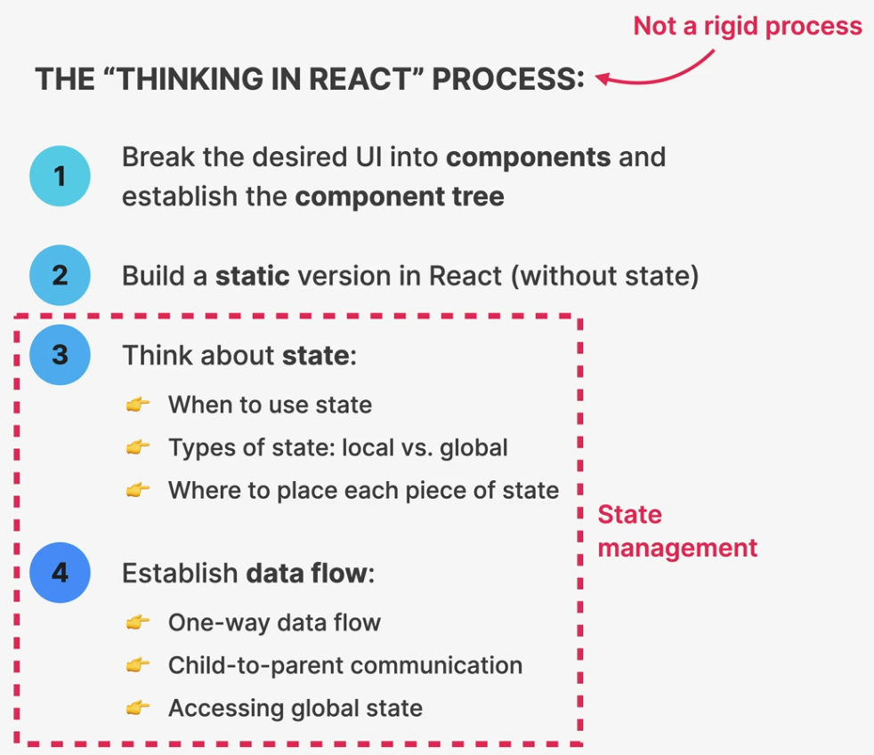

## 79. Fundamentals of State Management

**State management**: Deciding **when** to create pieces of state, what
**types** of state are necessary, **where** to place each piece of state, and
how data **flows** through the app.

| Local State | Global (Shared) State |
| :---------: | :----------: |
| Needed only by one or few components | Many components might need it |
| Acessed only by that components, and<br> it's child components | Accessible to every single component<br> in the entire app |
| Created with *useState* inside of a<br> certain component | Defined using *React Context API* or an external<br> state management library, as *Redux* |

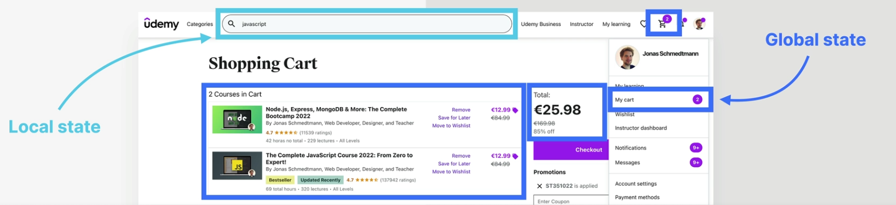

It's recomended to start with a local state, and change it to global as needed.

### When and where to use State

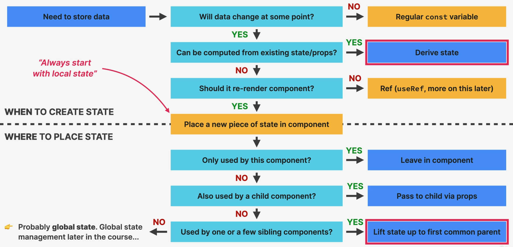

## 80. Thinking About State and Lifting State Up

Lifting Up the state is moving it from the component, to the closest parent
component.

In the code below, we need to use the value of *items* of the *Form* component,
to the *PackingList* component, in order to render the list. But, we cannot use
*props* to pass the values, because *Form* isn't *PackingList*'s parent.

```jsx
const Form = () => {
  const [description, setDescription] = useState("");
  const [quantity, setQuantity] = useState(1);
  const [items, setItems] = useState([]);

  const handleAddItem = (item) => {
    setItems((items) => [...items, item]);
  };

  const handleSubmit = (e) => {
    e.preventDefault();

    if (!description) {
      return;
    }

    const newItem = {
      id: Date.now(),
      description: description,
      quantity: quantity,
      packed: false,
    };

    handleAddItem(newItem);

    setDescription("");
    setQuantity(1);

    console.log(newItem);
  };

  return (
    <form className="add-form" onSubmit={handleSubmit}>
      <h3>What do you need for your 😍 trip?</h3>
      <select
        value={quantity}
        onChange={(e) => setQuantity(Number(e.target.value))}
      >
        {Array.from({ length: 20 }, (_, i) => i + 1).map((num) => (
          <option value={num} key={num}>
            {num}
          </option>
        ))}
      </select>
      <input
        type="text"
        placeholder="Item..."
        value={description}
        onChange={(e) => setDescription(e.target.value)}
      />
      <button>Add</button>
    </form>
  );
};

const PackingList = () => {
  return (
    <div className="list">
      <ul>
        {initialItems.map((item) => (
          <Item item={item} key={item.id} />
        ))}
      </ul>
    </div>
  );
};
```

In order to fix that, we need to *Lift up the State*, moving the *item* to a
Component whose is parent to it, and to *PackingList*, wich is the *App*
component.
We also move the handler function to the parent, keeping all the logic relative
to that state on the same component.

```jsx
export default function App() {

  const [items, setItems] = useState([]);

  const handleAddItem = (item) => {
    setItems((items) => [...items, item]);
  };

  return (
    <div className="app">
      <Logo />
      <Form onAddItems={handleAddItem}/> {/*prop name is a convention*/}
      <PackingList items={items}/>
      <Stats />
    </div>
  );
}
```

After that, we pass the *State* variable and the *setter function* down to the
others components as *props*

```jsx
export default function App() {

  const [items, setItems] = useState([]);

  setItems((items) => [...items, item]);
  };

  return (
    <div className="app">
      <Logo />
      <Form />
      <PackingList />
      <Stats />
    </div>
  );
}
```

Whenever multiple sibling components need to have access to the same state, we
move that state up, to the first common parent component

---

## 81. Reviewing "Lifting Up State"

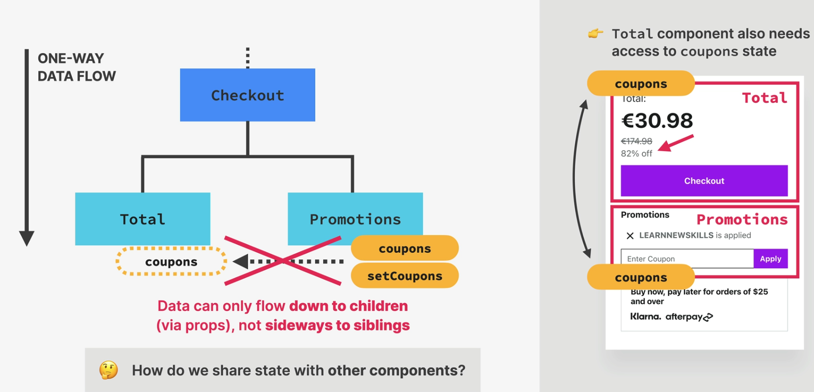

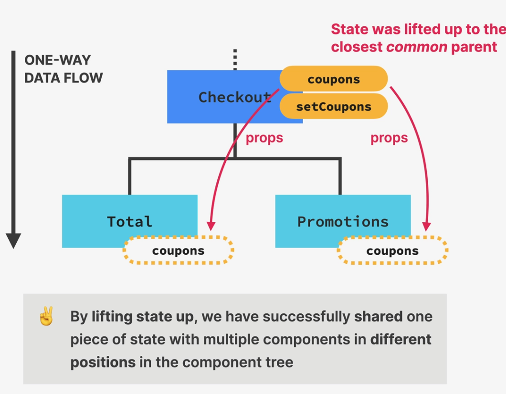

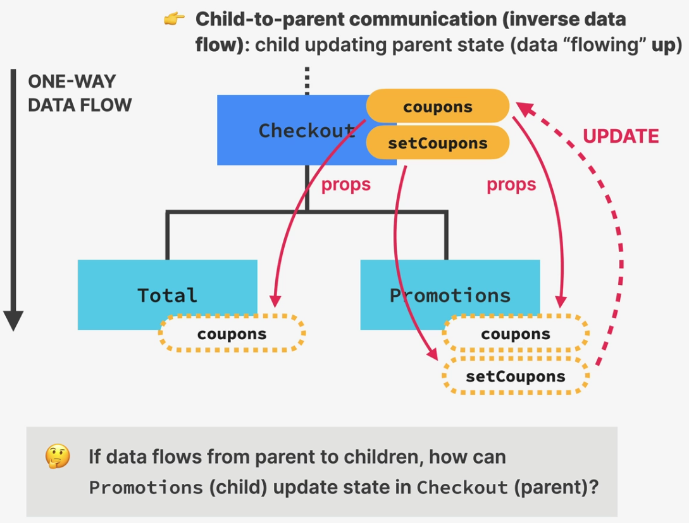

---

## 82. Deleting an Item: More Child-to-Parent Communication

## 83. Updating an Item: Complex Immutable Data Operation

## 84. Derived State

It is *State* that is computed from another piece of *State* or from *props*

In the example below, instead of using 3 pieces of *State*, and having to update
the 3 of them simultaneously (wich would cause 3 re-renders), *cart* state is
used as **singel source of truth** for the related data.

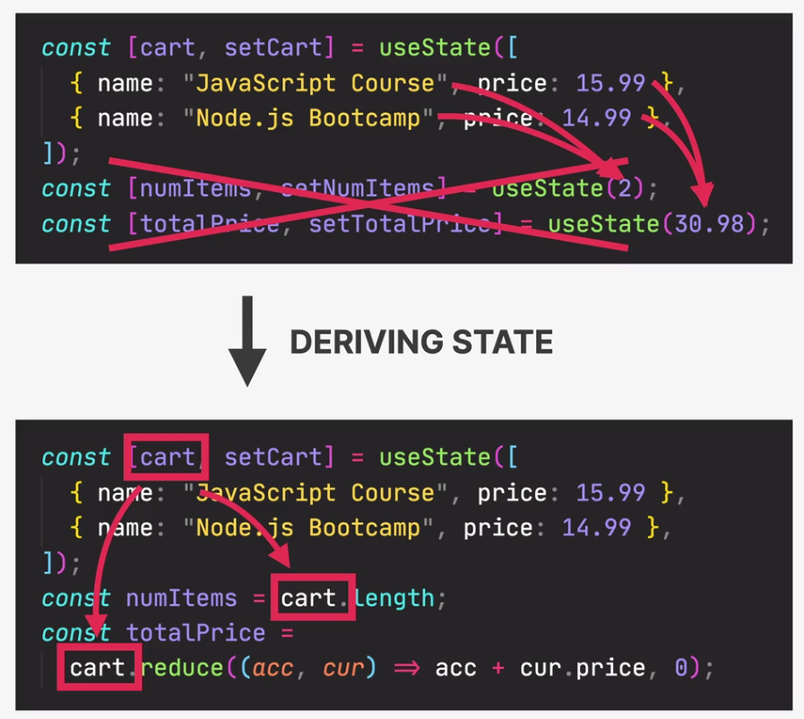

That works because updating the *cart* will re-render the component, that
executes the function again, making that the values for numItems and totalPrice
to be recalculated.

---

## 85. Calculating Statistics as Derived State

## 86. Sorting Items

## 87. Clearing the List

## 88. Moving Components Into Separate Files

## 90. The "children" Prop: Making a Reusable Button

Going back to the *Steps*  app, to turn the button into a reusabel component.

Changing from this:

```jsx
<div>
  <button
    style={{ backgroundColor: "#7950f2", color: "#FFF" }}
    onClick={handlePrevious}
  >
    Previous
  </button>
</div>
<div>
  <button
    style={{ backgroundColor: "#7950f2", color: "#FFF" }}
    onClick={handleNext}
  >
    Next
  </button>
</div>
```

Into this

```jsx
 <div>
  <Button
    bgColor={"#7950f2"}
    textColor={"#FFF"}
    onClick={handlePrevious}
    innerText={"Previous"}
    emoji="👈🏿"
  />
</div>
<div>
  <Button
    bgColor={"#7950f2"}
    textColor={"#FFF"}
    onClick={handleNext}
    innerText={"Next"}
    emoji="👉🏿"
  />
</div>


//Button component
const Button = ({ textColor, bgColor, onClick, innerText, emoji }) => {
  return (
    <button
      style={{ backgroundColor: bgColor, color: textColor }}
      onClick={onClick}
    >
      <span>{emoji}</span>
      {innerText}
    </button>
  );
};

export default Button;
```

Let's say that in the *previous* button we need to have the emoji **before** the
text, and in the *next* button we need the emoji to be **after the text**.
How can we customize the button inner text even more, *WITHOUT* creating another
prop?

The solution is the *children* prop. It's a prop that every *React* component
receives, and the value of the children prop is exactly what is between the
opening and closing tag of the component.

```jsx
//Adjusting the component to use children
const Button = ({ textColor, bgColor, onClick, children }) => {
  return (
    <button
      style={{ backgroundColor: bgColor, color: textColor }}
      onClick={onClick}
    >
      {children}
    </button>
  );
};


//Providing values to children props
<div className="buttons">
  <div>
    <Button
      bgColor={"#7950f2"}
      textColor={"#FFF"}
      onClick={handlePrevious}
    >
      👈🏿 Previous{" "}
    </Button>
  </div>
  <div>
    <Button
      bgColor={"#7950f2"}
      textColor={"#FFF"}
      onClick={handleNext}
    >
      {" "}
      Next 👉🏿{" "}
    </Button>
  </div>
</div>

```

## 91. More Reusability With the "children" Prop

## 96. Building the Static App: List of Friends

## 97. Building the Static App: Forms

## 98. Displaying the New Friend Form

## 100. Selecting a Friend

## 106. Setting Up the "usePopcorn" Project

## 107. How to Split a UI Into Components

Learn when and how to split interfaces into components

### Component size

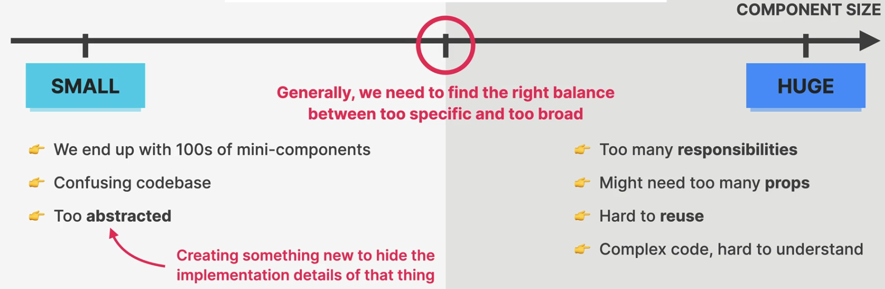

We should avoid using large components, or two small components. The final goal
is to achieve a balance.

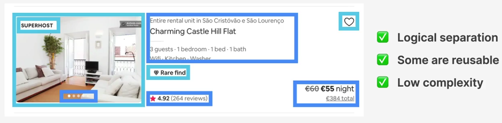

The 4 criteria to for splitting a UI into Components:

1. Logical separation of content/layout
2. Reusability
3. Responsability/ complexity
4. Personal coding style

**Sugestion:** When in doubt, start with a relatively big component, then split
it into smaller components as necessary

The four criteria above will help to understand when it's necessary to break a
component into smaller ones

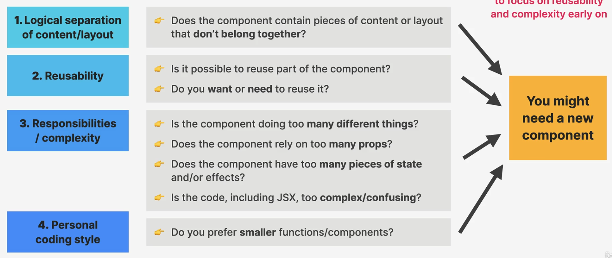

### General Guidelines

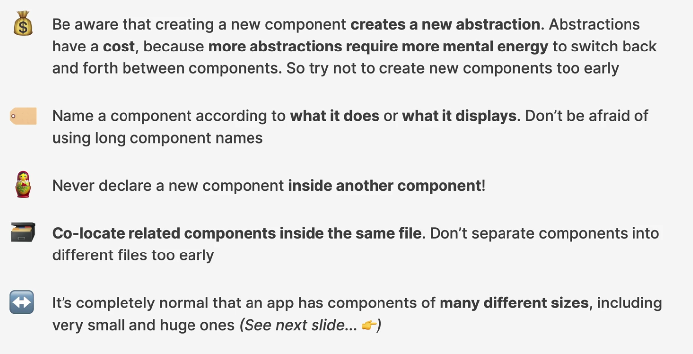

The smaller the components are, more reusable they tend to be.

---

## 109. Component Categories

Most of the components will fall under those 3 categories

1. Stateless/ presentational components
   - No State
   - Can receive Props, and simply present received data
   - Usually small and reusable
2. Stateful components
   - Have State
   - Can still be reused
3. Structural components
   - Pages, layouts or screend of the application
   - Result of **composition**
   - Can be huge and no reusable (but don't have to)

---

## 110. Prop Drilling

Is the need to pass data as props through several components, in order to
reach a deeply nested component.

## 111. Component Composition

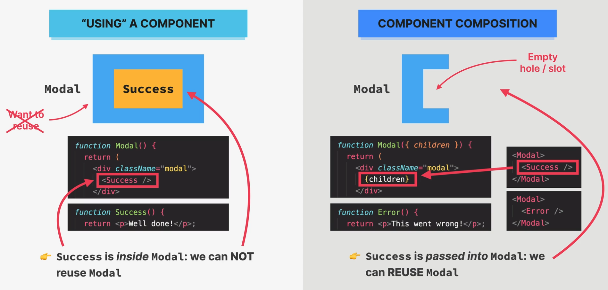

```jsx
function Modal () {
  return (
    <div className="modal">
      <Sucess />
    </div>
  )
}

//Success component file
function Success () {
  return <p>Well done!</p>
}

//Error component file
function Error () {
  return <p>Application Error!</p>
}

//in the app itself
<Modal>
```

When the component is used like this, inside of another component it's ties the
two components in a way that keeps the Modal component from be reused. Making it
basically a "success modal". It will become a single component.

In order to avoi this, comes the *Compoent Compositon*. It's done by passing
the inner componet through the *children prop*. This approach will enable the
*Modal* component to receive several types of components.

```jsx

//Modal component file
function Modal ({children}) {
  return (
    <div className="modal">
      {children}
    </div>
  )
}

//Success component file
function Success () {
  return <p>Well done!</p>
}

//Error component file
function Error () {
  return <p>Application Error!</p>
}

//in the app itself
<Modal>
  <Success />
</Modal>

<Modal>
  <Error />
</Modal>
```

**Component Composition** is combining different components using the *children*
prop (or other explicitly defined prop).

Composition use cases:

1. Create highly reusable components
2. Fix prop drilling

Composition is only possible because components **don't need to know** their
children in advance

---

## 112. Fixing Prop Drilling With Composition (And Building a Layout)

## 113. Using Composition to Make a Reusable Box

## 114. Passing Elements as Props (Alternative to children)

Another way of passing the components is using an especific prop to do it.

Below, we're using the child prop to pass down components do the *Box* component

```jsx
//app
      <Main>
        <Box>
          <MovieList movies={movies} />
        </Box>
        <Box>
          <WatchedSummary watched={watched} />
          <WatchedMovieList watched={watched} />
        </Box>
      </Main>

//box component
const Box = ({ children }) => {
  const [isOpen, setIsOpen] = useState(true);

  return (
    <div className="box">
      <button className="btn-toggle" onClick={() => setIsOpen((open) => !open)}>
        {isOpen ? "–" : "+"}
      </button>
      {isOpen && children}
    </div>
  );
};
```

Another way of doing it is creating an prop for it. The prop can have any
choosen name.

```jsx
//box component
const Box = ({ element }) => {
  const [isOpen, setIsOpen] = useState(true);

  return (
    <div className="box">
      <button className="btn-toggle" onClick={() => setIsOpen((open) => !open)}>
        {isOpen ? "–" : "+"}
      </button>
      {isOpen && element}
    </div>
  );
};

//app
      <Main>
        <Box element={<MovieList movies={movies} />} />
        <Box element={
          <>
          <WatchedSummary watched={watched} />
          <WatchedMovieList watched={watched} />
          </>
        } />
      </Main>
```

Using *children* is the prefered way of doing things.

---

## 115. Building a Reusable Star Rating Component

In order to guarantee maximum reusability for the rating component, it will be
created on a separeted file, and all it's style information will be contained on
it.

```jsx
const containerStyle = {
  display: "flex",
  alignItems: "center",
  gap: "16px",
};

const starContainerStyle = {
  display: "flex",
  gap: "4px",
};

const textStyle = {
  lineHeight: "1",
  margin: "0",
};

const StarRating = ({ maxRating = 5 }) => {
  return (
    <div style={containerStyle}>
      <div style={starContainerStyle}>
        {Array.from({ length: maxRating }, (_, i) => (
          <span>S{i + 1}</span>
        ))}
      </div>
      <p style={textStyle}>{maxRating}</p>
    </div>
  );
};

export default StarRating;
```

Breaking down this component, we have:

The styles being applied. An object containing the style information is passed
to the *style={ }* property

```jsx
const containerStyle = {
  display: "flex",
  alignItems: "center",
  gap: "16px",
};

const starContainerStyle = {
  display: "flex",
  gap: "4px",
};

const textStyle = {
  lineHeight: "1",
  margin: "0",
};
```

An array method, used to create the stars dinamically

```jsx
{Array.from({ length: maxRating }, (_, i) => (
          <span>S{i + 1}</span>
        ))}
```

The value for star length is received through props. A default values is
assigned to *maxRating*, so the component can be rendered, even if the user
does not provide a value to the prop. In the example below, the value 5 is
set as default. That's possible due to object destructuring

```jsx
const StarRating = ({ maxRating = 5 })
```

---

## 116. Creating the Stars

## 117. Handling Hover Events

## 118. Props as a Component API

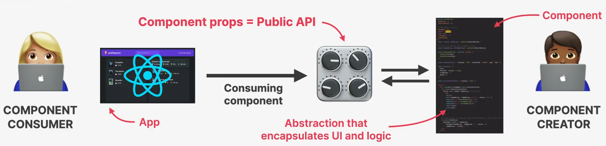

When creating a component we should always have in mind that it might be used by
someone else. From that perspective, the creator writes the components, with
all necessary props, and the user implements that component, using the props
to communicate with the component.
So, the *props* works as a the public API from the component. As creators, when
we define the props a given component will use, we're defining the public
interface of that component. At the same time, we're choosing how much of the
complexity of the component we want to expose to the consumer of the API.

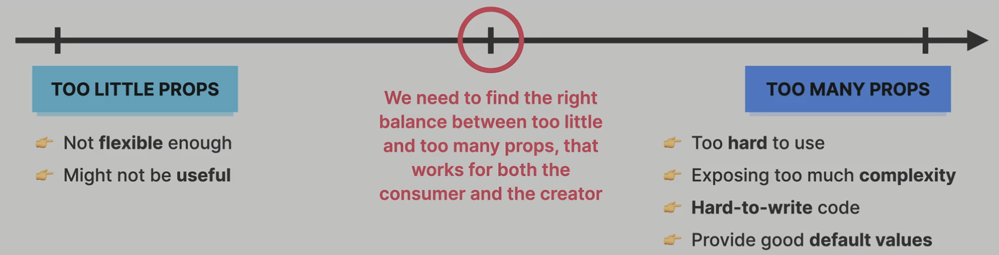

When defining the props that will be exposed to the user, we should try to
strike a good balance between *too little* and *too many* props. After all,
that's what will define how much complexity we're exposing to the user.

---

## 120. PropTypes

*PropTypes* allows us to specify the type of the value, that we expect to be
passed in to each of the component props. Typescript is more indicated in those
circunstances, but *React* has built in propTypes that will be used below, in
order to show how it works.

```jsx
import PropTypes from {prop-types}

StarRating.propTypes = {
  maxRating: PropTypes.number,
  defaultRating: PropTypes.number,
  color: PropTypes.string,
  size: PropTypes.number,
  messages: PropTypes.array,
  className: PropTypes.string
  onSetRating: PropTypes.func,
}
```

In case the type doens't match, there will be a warning in the browser console.

---

## 124. Components, Instances, and Elements

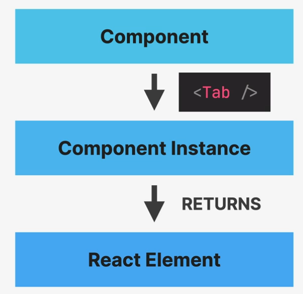

### Component

- Is a piece of UI
- It's a JS function, that returns *React* elements (element tree), usually
  written in *JSX*
- It works as a blueprint or a template

### Component Instance

- Instances are created when we use components
- Actual **"physical" manifestation** of a component
- Has it's own state and props
- Has a **lifecycle**

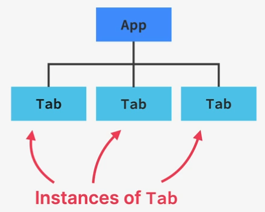

### React Element

- JSX is converted to *React.createElement()* function calls.
- A *React* element is **the result of these function calls**
- Information necessary to create *DOM* elements

### DOM Element (HTML)

- Visual representation of the component instance in the browser

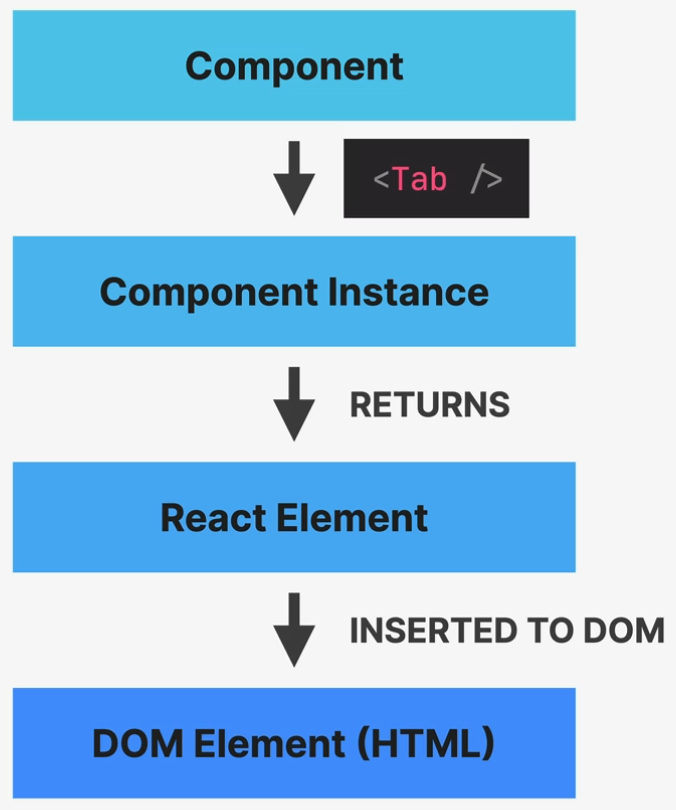

---

## 126. How Rendering Works: Overview

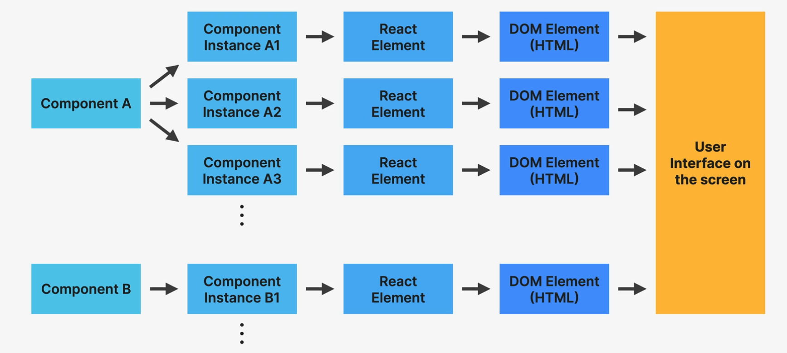

In *React* rendering is **not** updating or displaying elements on the screen.
Rendering only happens **internally** inside *React*, it **does not** produces
visual changes.

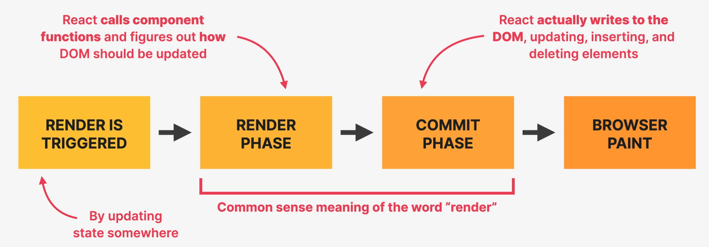

### Render is Triggered

- The two situations that trigger renders
  1. Initial render of application
  2. *state* is update in one or more component instances (re-render)
  
- The render process is triggered for the **entire application**. It may look as
  only the component where the state update happens is re-rendered, but that's
  not how it works.
- Renders are not triggered immediately, but *scheduled* for when the *JS* engine
  has some "free time". There is also batching of multiple *setState* calls in
  event handlers.

---

## 127. How Rendering Works: The Render Phase

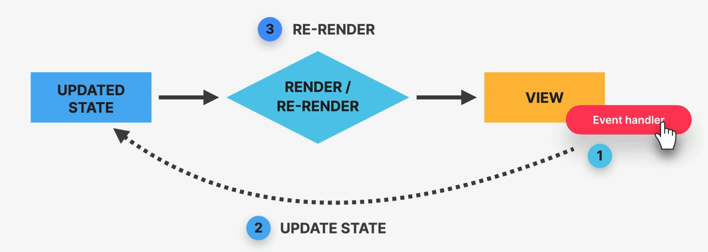

Some misconceptions in the image above are:

1. Rendering is not about the view, or the *DOM*. It's about calling component
   functions.
2. The *DOM* will not be updated for the entire component instance.

### The Render Phase

1. *React* will find all the components that triggered a re-render, all call
   their's correpondent component function.
2. That will create updated *React* elements, that all toghether make up the
   *Virtual DOM*

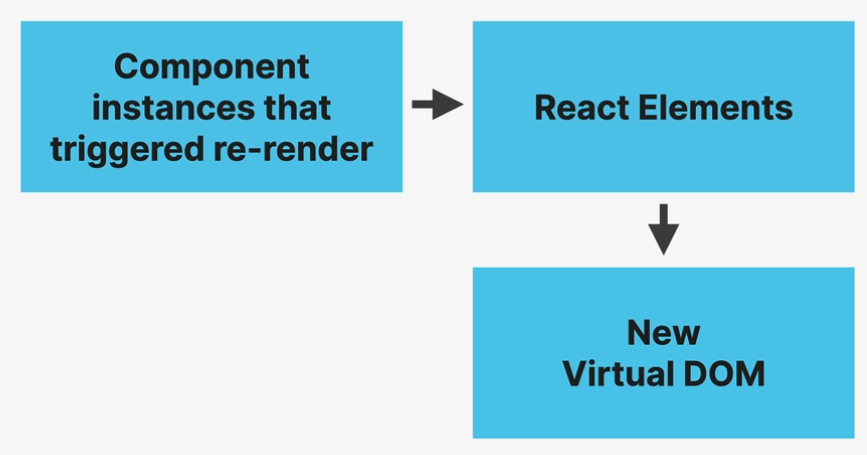

#### Virtual DOM

In the initial render, *React* will take the entire component tree, and transform
it into a one big *React* element, called the *React Element Tree*. That's what
is called *virtual DOM*

- **Virtual DOM** is the tree of all *React* elements created from all instances in
the *component tree*

- It is cheap and fastto create multiple *React elements trees*, because it's
  nothing more than a JS object

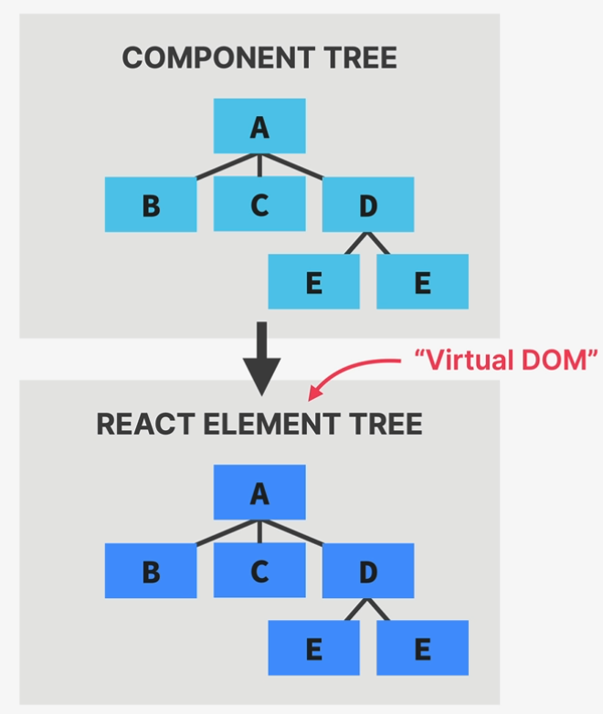

- If a *state* update happens, a new *React element tree* will be created.

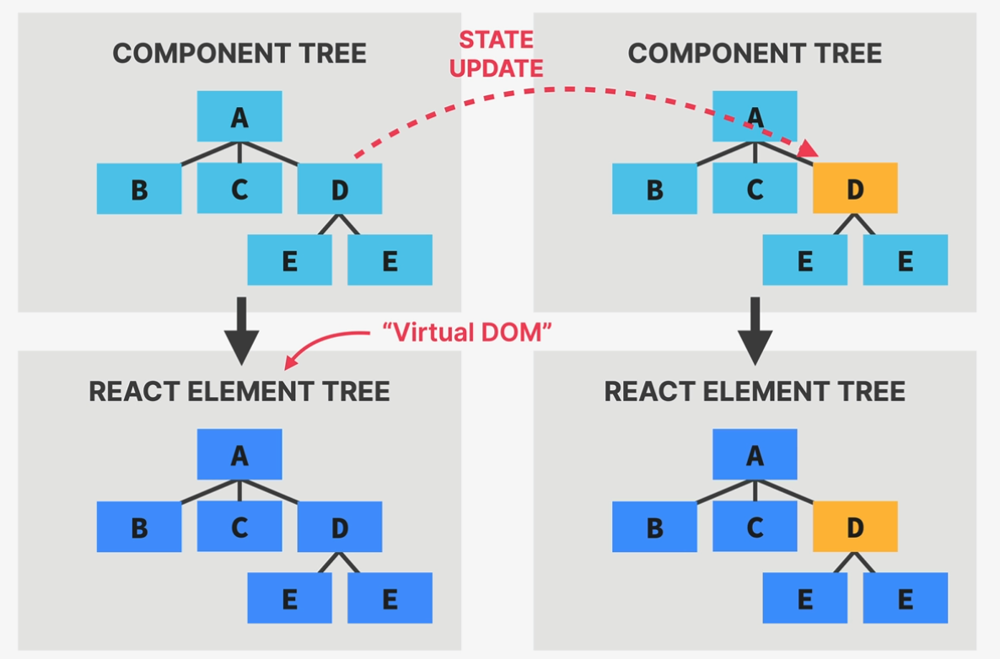

🚨 It's important to notice that rendering a component will cause **all of it's
child components to be rendered as well** ( no matter if props changed or not).

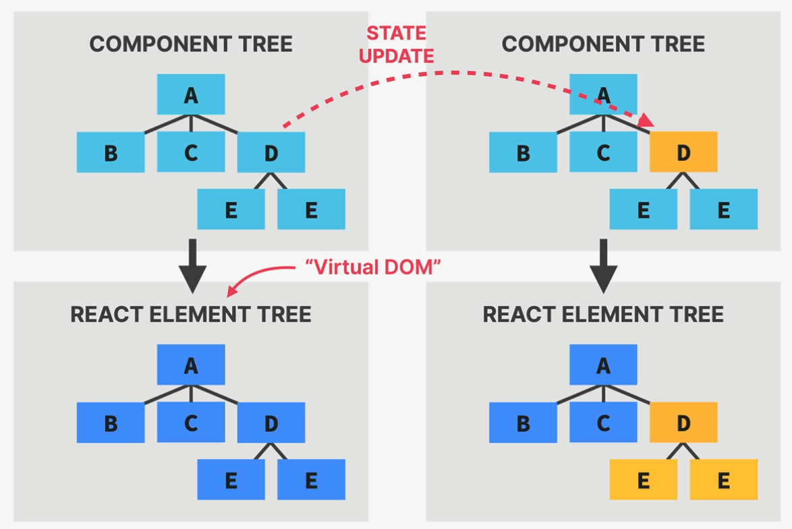

It means that if you update the highest component on the component tree, every
child of that component will be re-rendered.

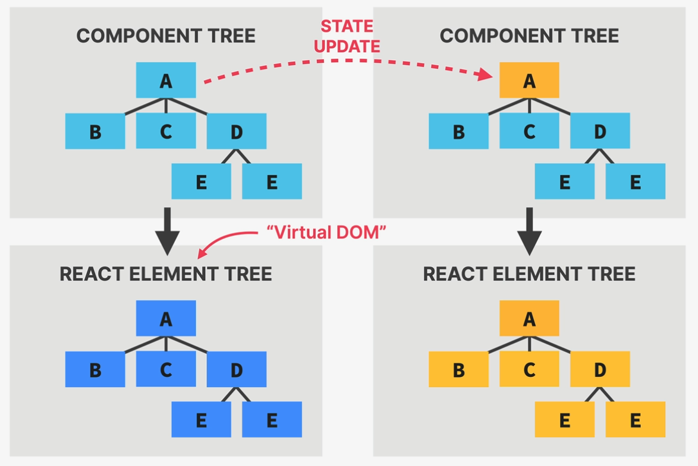

*Reacts* does this because it doesn't know before hand if an update on a
component will affect or not that components childs's. So, it will update
everything under the updated parent component.
We should also notice that it doesn't meant that the entire *DOM* will be
updated. Only the *virtual DOM* will be recreated.

The newly created *virtual DOM* will be reconciled with the current *Fiber Tree*,
that exists before the state update. This process is perfomed in *React's reconciler*,
wich is called *Fiber*. The output of this reconciliation will be an updated
*Fiber tree*

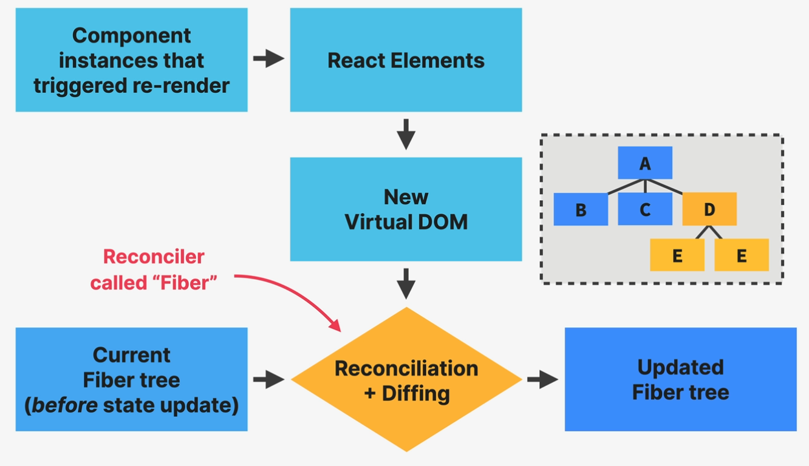

#### Reconciliation

It's a proccess that decides which *DOM* elements need to be inserted, deleted or
updated, in order to reflect the latest state changes.
The result of the *Reconciliation* will be a list of DOM operations that are
necessary to update the current *DOM* with the new *state*

The Reconciler is like the engine of *React*. It keeps us from touching the *DOM*
directly. It tells *React* how the next snapshot of the UI should look like,
based on *state*. The current reconciler in *React* is called *Fiber*

##### Reconciler: Fiber

In the initial render of the app, fiber takes the *React element tree*
  (virtual DOM) and builds a *Fiber tree*

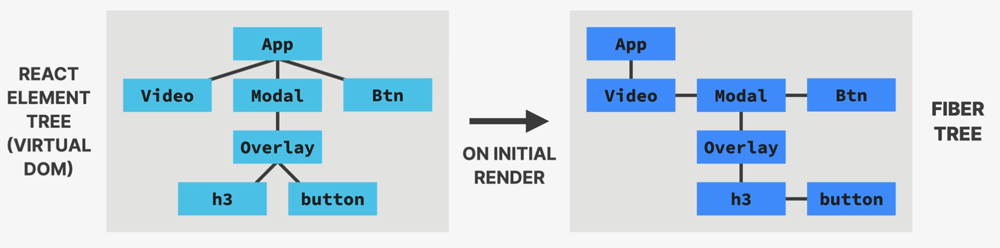

It's  an internal tree that has a *fiber* for each component instance and *DOM*
element

Fibers are **not** recreated on every render. It's never destroyed. It's only
mutated over and over again, in future *reconciliation* steps.

Fiber keeps track of:

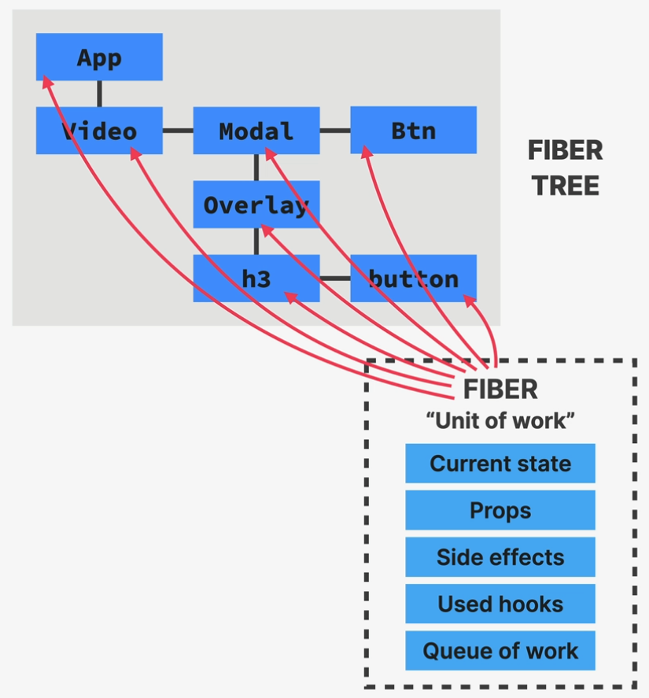

While in the *Rect Element Tree* the elements are organized in *parent x child*
relationship, in the *Fiber tree* it's first child has a link to it's parents,
and all the other children have a link to their previous sibling. This structure
is called a *linked list*

Both trees hold *React* elements and regular *html* elements, such as the *h3*
and the *button* elements. Both trees are a complete representation of the entire *DOM*
structure.

Having *Fibers* as  *units of work*, it allows the work to be performed
**asynchronously**. That bring the possibility of having the rendering process
split into chunks, tasks can be prioritizes, and work can be **paused, reused**
or **throwed away**. So long renders don't pause the JS engine.

That's only possible because the *Render* phase doesn't produce any visible
output for the *DOM*

#### Reconciliation Process

- A state update occurs
- That triggers a re-render
- A new *Virtual DOM* is created
- The new *Virtual DOM* is reconciled with the current *Fiber Tree*
- It will generate an *Update Fiber Tree (workInProgress)*

When *Reconciliation* needs to happen, *Fiber* walks through the tree, step by
step, and analyses exactly what needs to change between the current *Fiber tree*
and the *Updated Fiber Tree*, based on the new *Virtual DOM*

The process of comparing elements based on their position in the tree is
called **Diffing**

When the process is over, all changes will be placed in a list called
*List of Effects*, that will be used in the *Commit Phase* to update the *DOM*

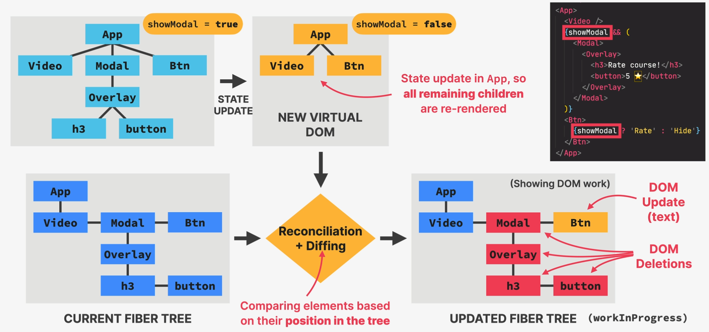

### Back to the Render Phase

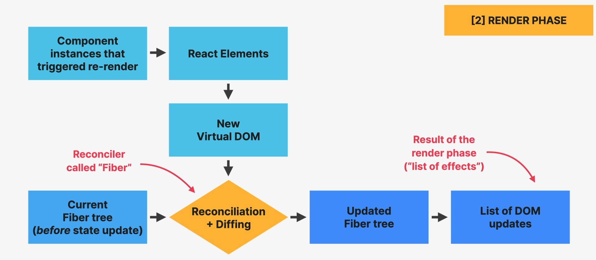

---

## 128. How Rendering Works: The Commit Phase

The *Commit Phase* is when **React writes to the DOM**: insertion deletes and
updates (list of *DOM* updates are "flushes" to the *DOM*)

**Commiting is synchronous**. *DOM* is updated in one go, to prevent that
partial results are showed, keeping a cohesive UI.

After the commiting, the *workInProgress* fiber tree becomes the current fiber
tree **for the next render cycle**

The browser will then notice that the DOM has been changed, and it will repaint
the screen. whenever it has some iddle time.

The library responsible for writting to the DOM isn't React itself, but
*React DOM* . It happens because React was designed to be use independently of
the platform (host).

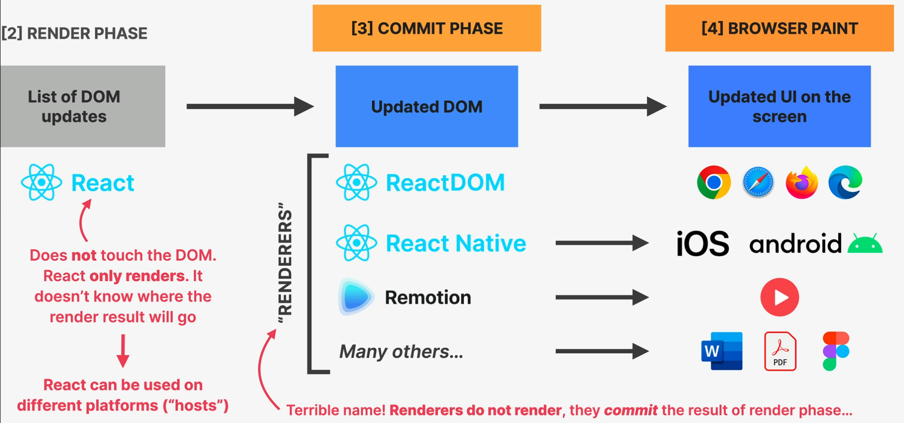

### Recap

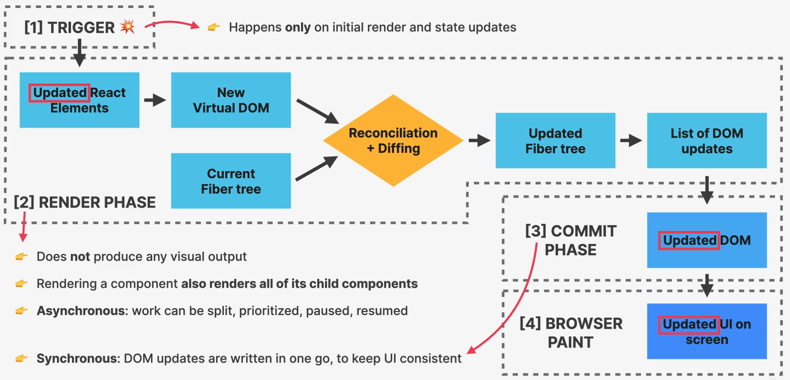

---

## 129. How Diffing Works

Diffing is comparing two elements step by step between two renders, based on their position in the tree.

It's based in two fundamental assumptions:

1. Two elements of different types will produce **diferrent trees**
2. Elements with a stable key prop **stay the same across renders**

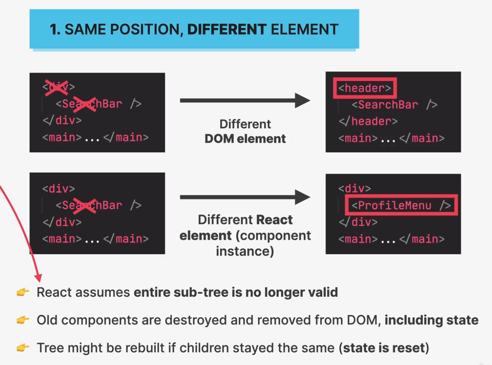

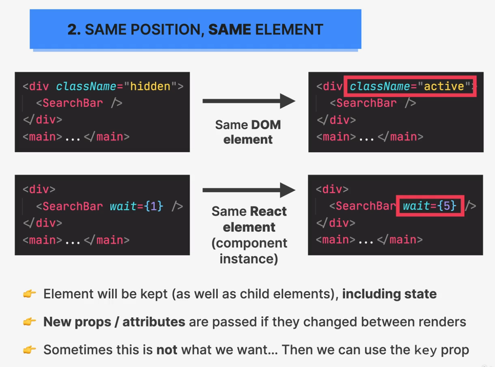

---

## 131. The Key Prop

- It's a special prop that's used to tell the diffing algorithm that an element is unique.
- Allows react to distinguish among multiple instances of the same component type.
- When a key **stays the same across renders**, the element will be kept in the *DOM*
  (even if the position in the tree has changed)
- When a key **changes between renders**, the element will be destroyed and a new one
  will be created (even it the position in the tree is the same between renders)
- The big cases for the *key* prop use are:

1. Using key in lists (stable key)

   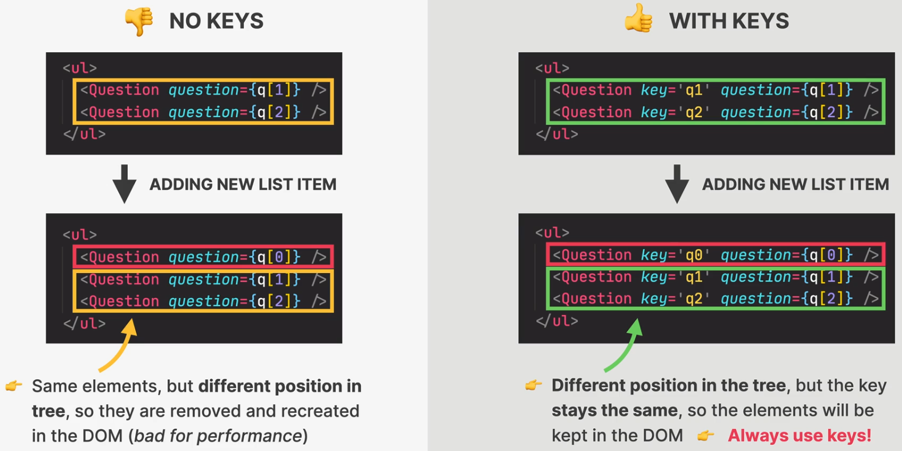

   It's important to always use the *key* prop, when we have multiple child elements of
   the same type

2. Using keys to reset *state* (changing key)

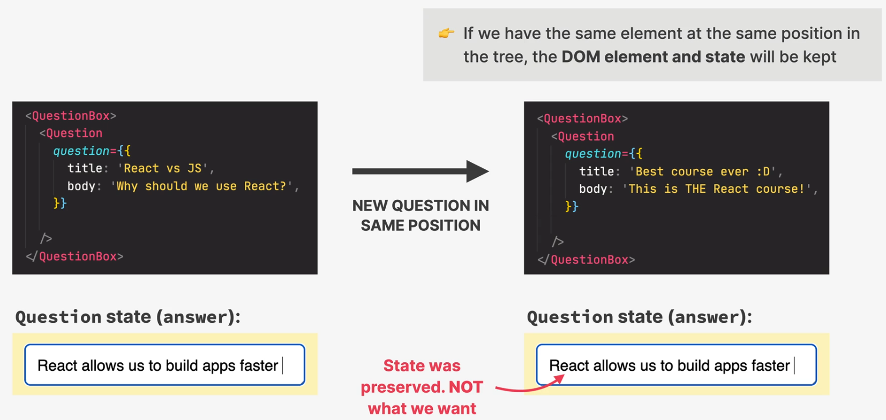

To solve that, we can use the *key* prop, in order to allow *React* that a change happend,
and that the state should be updated

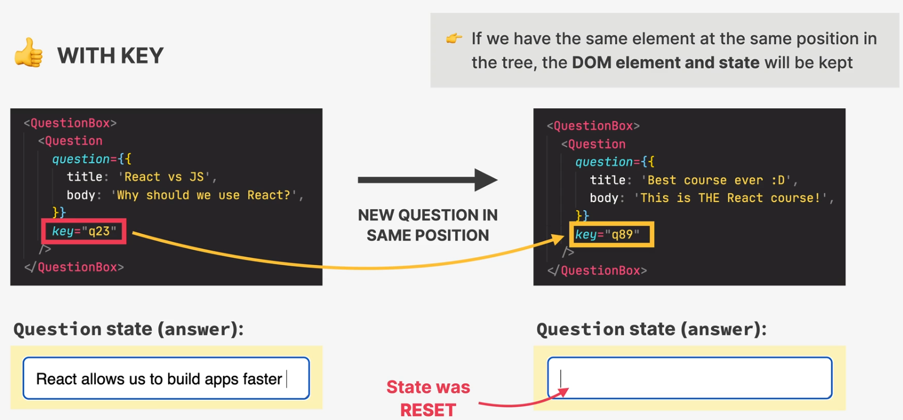

---

## 134. Rules for Render Logic: Pure Components

### The two type  of logic in *React* components

#### Render Logic

- Code that lives at the top level of the component function
- Participates in describing how the component view looks like
- Executed every time the component renders
  
#### Event Handler Function

- Executed as the consequence of the event that the handler is listening for
- Code that actually **does things**: update state, perform an HTTP request,
read an input field, navigate to another page, etc.

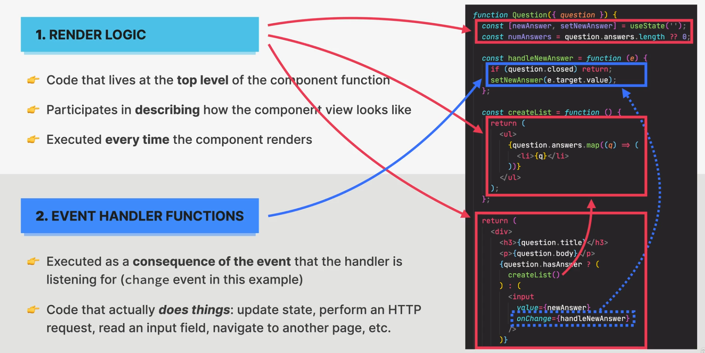

*React* requires that components are pure when it comes do *Render Logic*.

#### What does *pure* mean?

##### Function Programming Principles

- **Side effect**: dependency on or modification of any data outside the function
  scope. Ex.: HTTP requests, mutating external variables

- **Pure Function**: a function that has no side effects. Does not change any
  variables outside its scope.
- Given the same input, a pure function **always** returns the **same output**

### Rules for Render Logic

- Components **must be pure** when it comes do render logic: given the same props
  (input), a component instance should always return the same JSX (output)
- Render logic **should not** produce any side effects: no interaction with the
  "outside world" is allowed. So, in render logic:
  - Do not perform network requests
  - Do not start timers
  - Do not directly use the DOM API
  - Do not mutate objects or variables outside the function scope (that's why we
  can't mutate props)
  - Do not update state or refs (this will create an infinite loop)
- Side effect are allowed in **event handler functions**
- There's also a special hook to register side effects (useEffect)

---

## 135. State Update Batching

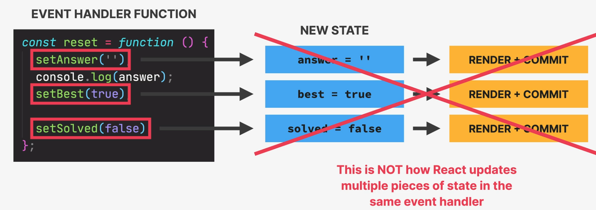

The state updates above will be batched in a single event update for the entire
event handler

### Batching in event handler functions

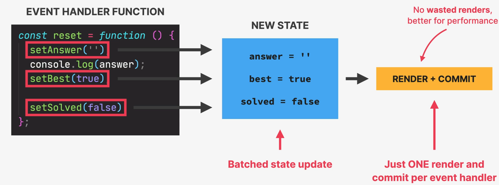

- An state update will only be reflected in the state variable after the re-render
- Updated state variables are not immediately available after set state call, but
only after the re-render
- This is also valid when there's only one state variable being updated
- If we need to update state **based on previous update**, we use setState
  with callback

  ````typescript
  const [answer, setAnswer] = useState();

  setAnswer(answer => setAnswer('value'))
  ````

### Batching beyond event handler functions

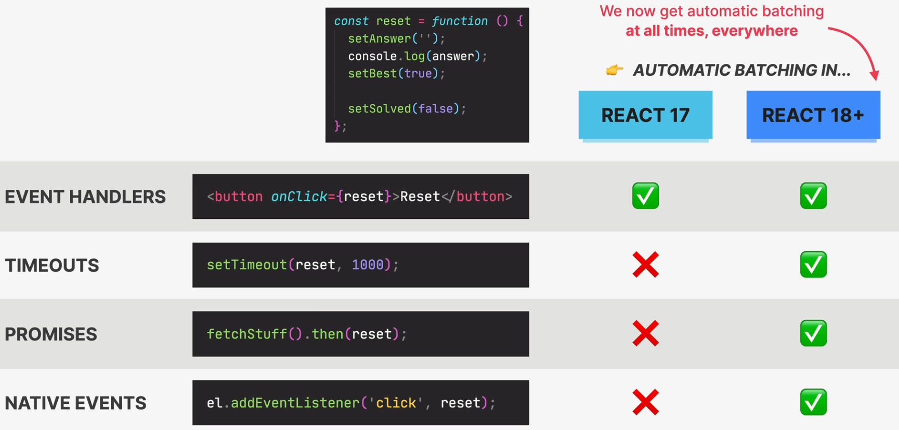

We can **opt out** of automatic batching by wrapping a state update in 

```typescript
*ReactDOM.flushSync()
```
---

## 137. How Events Work in React

First, we'll see how events are handled in HTML.

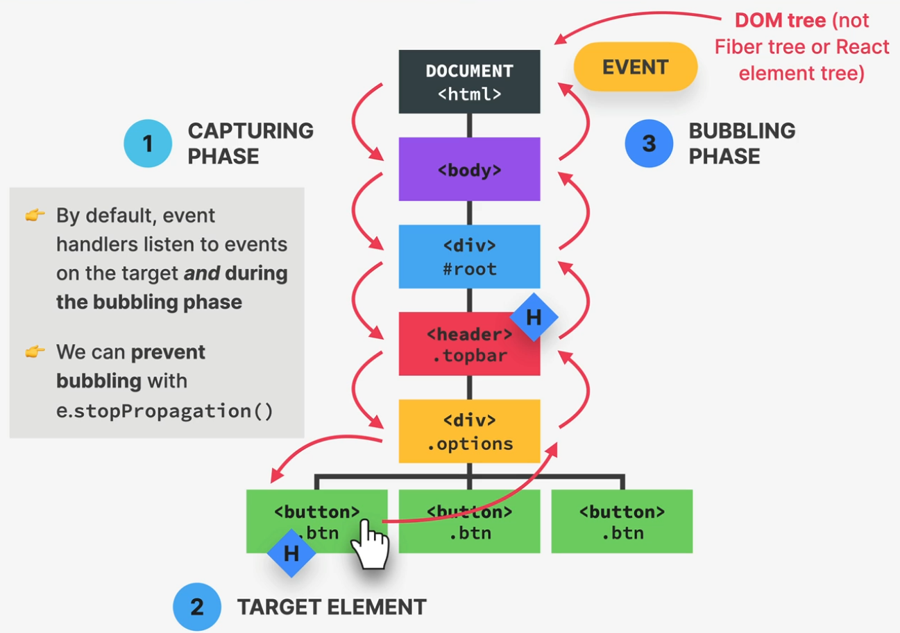

- The *event* was generated by clicking  on the button
- When it was created, it appeared on the highest level of the *DOM* tree
- In the *capturing phase*, it navigated throuhg the tree, in order to find where
  the *event* was originally triggered.
- Once there, it calls the handler function (if one exists)
- After that, the *event* object goes all the way back up (bubbling phase)
- It's important to notice that during the *bubbling phase*, any handlers that
  are listening for a *click* will be executed

This bubbling behaviour allows us to use *Event Delegation* in order to have
one handler fuction in a parent element, to take are of it's childer.

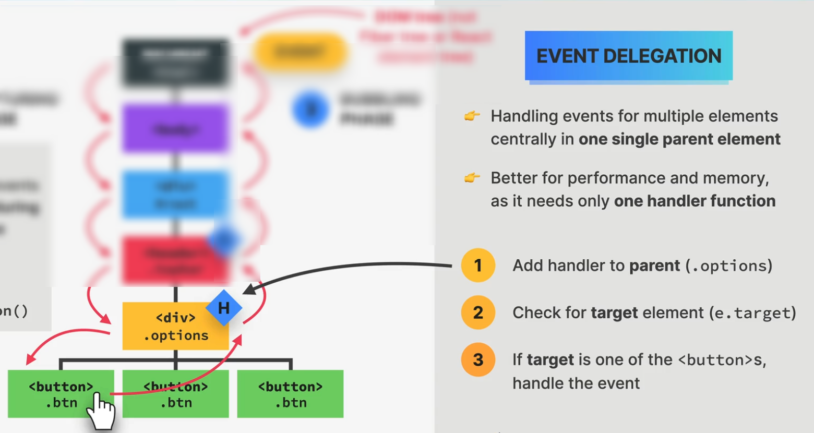

*React* uses *event delegation* in order to register all handler functions on the
**root DOM container**

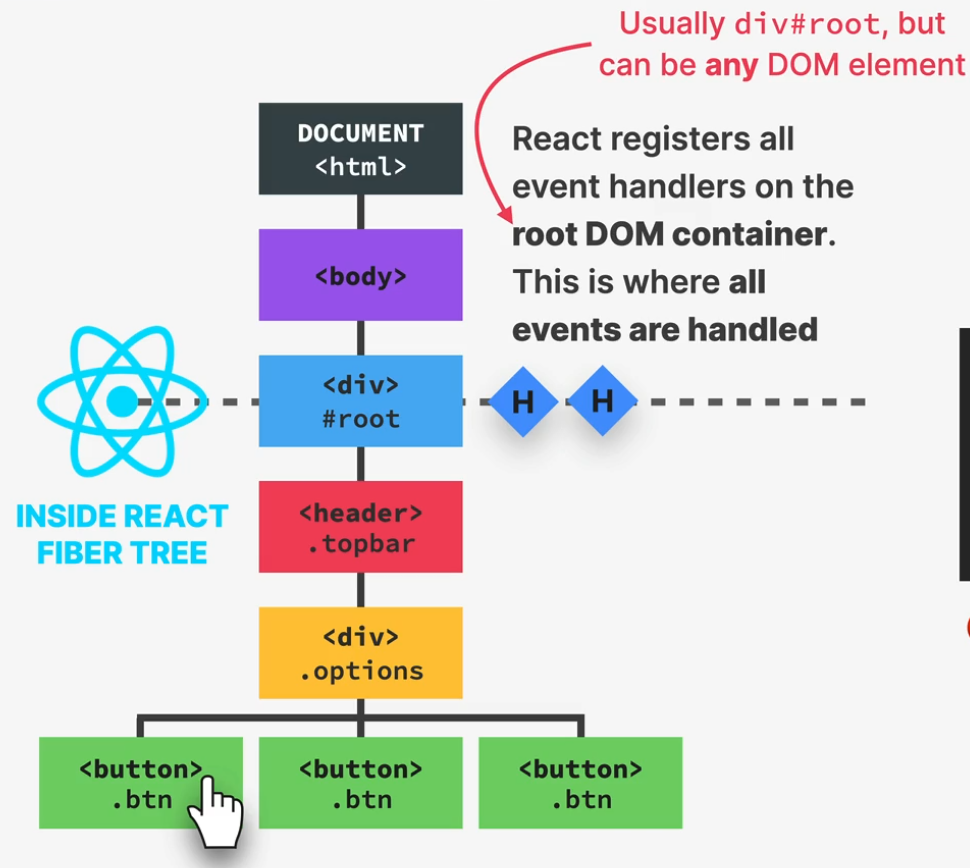

### React Event Object

In JavaScript we have access to the native html event object. In React we'll
have access to a *Synthetic Event*

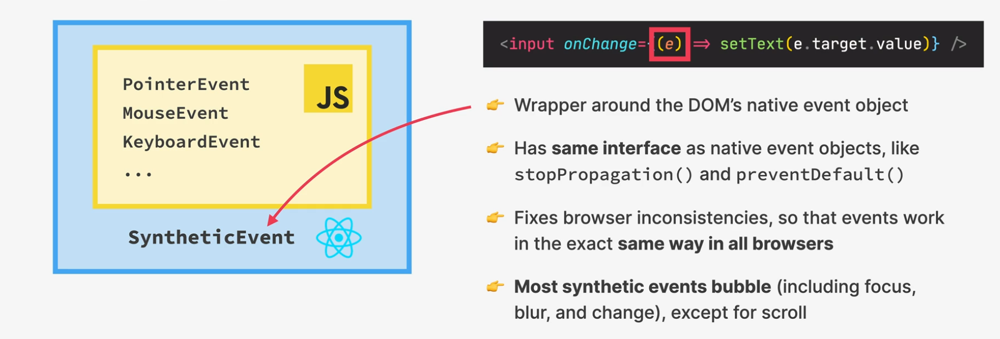

### Differences between JS and React Events

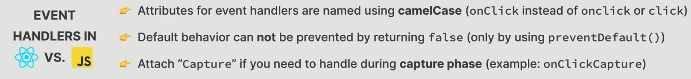

## 138. Libraries vs Frameworks & the React Ecosystem
