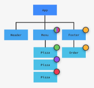

# The Ultimate React Course (2025)

## Previous topic

```markdown
Seção 4, capítulo 33: Pure React
```

## Next topic

```markdown
Seção 5, capítulo 37: Components, Props & JSX
```

## Section 5 : Working with Components, Props, and JSX

### 33. Rendering the Root Component and Strict Mode

```js
// Arquivo ./src/index.js
//React 18+

import React from "react";
import ReactDOM from "react-dom/client";

const App = () => {
  return <h1>Hello React!</h1>;
};

const root = ReactDOM.createRoot(document.getElementById("root"));
root.render(<App />);
```

- "index.js" é utilizado pelo WebPack, como sendo o ponto inicial do projeto. Por isso da necessidade de se criar esse arquivo, com esse nome.

- Os imports no início do arquivo, são as bibliotecas básicas necessárias para o projeto.

- A seguir, tem o componente App, dentro do qual será inserido o código da aplicação. O nome não precisa ser esse, mas o componente deve ser iniciado por letra maiúscula.

- É criada a variável root, a qual recebe a div de id _root_ que está em _./public/index.html_. Será dentro dessa div que o React irá renderizar a aplicação.

- Posteriormente, é utilizado o método _render_ , para renderizar a aplicação.

- Essa é a forma de renderizar a aplicação para o React 18+.

- No caso do React 17- o código seria:

```js
// Arquivo ./src/index.js

import React from "react";
import ReactDOM from "react-dom";

const App = () => {
  return <h1>Hello React!</h1>;
};

React.render(<App />, document.getElementById("root"));
```

- Ao invés de renderizar o _App_ como um root component, pode-se utilizar o _strict mode_ , simplesmente envolvendo o _App_ em um _strict mode component_. Dessa forma, durante o desenvolvimento, o _strict mode_ renderizará o componente duas vezes, a fim de verificar se existem bugs, e verificar se estão utilizadas versões ultrapassadas da

  _React API_ .

```js
// Arquivo ./src/index.js
//React 18+

import React from "react";
import ReactDOM from "react-dom/client";

const App = () => {
  return <h1>Hello React!</h1>;
};

const root = ReactDOM.createRoot(document.getElementById("root"));
root.render(
  <React.StrictMode>
    <App />
  </React.StrictMode>
);
```

### 35 . Components as Building Blocks

- React applications are entirely made out of components.

- React renders a view for each component, and all those views toghther make up the UI.

- Each componente has it's own data, logic and appearence.

- Components can be reused, and nested inside other components.

### 36. Creating and Reusing a Component

- In React, we create components using functions.

- The function name has to start with an upper case letterr.

- The funciton must return some markup (ussualy in form of a jsx)

  ```react
  function Pizza() {
    return <h2>Pizza</h2>
  }
  ```

- For the component to be displayed in the screen, it should be used inside of the component wich is being redered on the screen.

  ```js
  // Arquivo ./src/index.js

  import React from "react";
  import ReactDOM from "react-dom/client";

  const App = () => {
    return <h1>Hello React!</h1> <Pizza />;
  };

  const root = ReactDOM.createRoot(document.getElementById("root"));
  root.render(
      <App />
  );
  ```

- Each component can only return one element. So, in order to avoid an error, the return of the App component shoul de encapsulated inside of a _div_ .

- Once the _Pizza_ component is nested inside _App_ it will be presented on the screen. Pizza is nested inside of App.

- What should be nested is the component, and not it's declaration.

  ```js
  // Arquivo ./src/index.js

  import React from "react";
  import ReactDOM from "react-dom/client";

  const App = () => {
    return (
      <div>
        <h1>Hello React!</h1>
        <Pizza />
      </div>
    );
  };

  const root = ReactDOM.createRoot(document.getElementById("root"));
  root.render(<App />);
  ```

  - Below, more data is added to the pizza component. This data was copied from the file data.js

  ```typescript
  function Pizza() {
  	return <div>
  		
  		<h2>Pizza Spinachi</h2>
  		<p>Tomato, mozarella, spinach, and ricotta cheese</p>
  	</div>
  }
  ```

- The most basic (and wrong) way of using a component, is just by manually copying it several times, into the

  _App_ .

  ```typescript
  import React from "react";
  import ReactDOM from "react-dom/client";

  const App = () => {
    return (
      <div>
        <h1>Hello React!</h1>
        <Pizza />
        <Pizza />
        <Pizza />
      </div>
    );
  };
  ```

  ### 37. What is JSX

  

  - JSX is a declarative syntax to describre what components look like and how they work.
  - Every component must return one block of JSX, that React will use to render the compoent in the UI.

  

  - JSX is an extension of JavaScript that allows us to embed JS, CSS and React components into HTML.
  - JSX is declarative: it describes what the UI should look like using JSX, based on current data. JSX tells React **what** it should show on screen, and not **how** it should do it.

### 38. Creating more components

The components for the others structural elements from the page, will be created.

```jsx
//Header
const Header = () => {
  return <h1>Fast React Pizza Co. </h1>;
};
```

```jsx
//Menu
const Menu = () => {
  return (
    <div>
      <h2>Our Menu</h2>
      <Pizza />
      <Pizza />
      <Pizza />
    </div>
  );
};
```

```jsx
//Footer
const Footer = () => {
  return (
    <footer>{new Date().toLocalTimeString()}. We're currently open</footer>
  );
};
```

The _App_ will be updated accordingly

```jsx
const App = () => {
  return (
    <div>
      <Header />
      <Menu />
      <Footer />
    </div>
  );
};
```

### 39. Styling React Applications

In JSX there are several ways of applying style to a component. One of them is
to use the inline style.

```javascript
const Header = () => {
  return <h1 style={{ color: red }}>Fast React Pizza Co.</h1>;
};
```

In JSX, in order to use the inline style it's necessary to pass the style
information inside of a javascript object ( the inner {}). And, to use JS,
is necessary to "enter in JS mode" (the outter {}). All the other style
information will be placed inside of the JS object.

```javascript
const Header = () => {
  return (
    <h1 style={{ color: red, fontSize: "32px", textTransform: "uppercase" }}>
      Fast React Pizza Co.
    </h1>
  );
};
```

Since it is all in a JS object, the style could also be informed like this

```javascript
const Header = () => {
  const style = { color: red, fontSize: "32px", textTransform: "uppercase" };

  return <h1 style={style}>Fast React Pizza Co.</h1>;
};
```

Another option is to use an external css file, define the style into classes,
and use the classe names where necessary. We should not foget to import the
CSS file, prior it's use.

```javascript
import "./index.css"; //just an example
```

### 42. Passing and receiveing Props

```javascript
const Menu = () => {
  return (
    <main className="menu">
      <h2>Our Menu</h2>
      {/*defining the props, and their value*/}
      <Pizza
        name="Pizza Spinaci"
        ingredients="Tomato,
      mozarella, spinach, and ricotta cheese"
        photoName="pizzas/spinaci.jpg"
        price="10"
      />
    </main>
  );
};

const Pizza = (props) => {
  //receiveing the props in the component
  return (
    <div>
       //using the props
      <h3>{props.name}</h3>
      <p>{props.ingredients}</p>
    </div>
  );
};
```

The props values don't have to be defined on the same order every time

```javascript
<Pizza
  name="Pizza Funghi"
  ingredients="Tomato, mushrooms"
  price="12"
  photoName="pizzas/funghi.jpg"
/>
```

### 43. Props, Immutability, and One-Way Data Flow

We use props to move data from a parent component to a child component

;

Props are like arguments passed to a JS function. Single values, arrays,
objects, functions and other components can be passed as props.

;

Props are read only. If you need to mutate props, it has to be done using State.

Props are basically objects. And when you copy an object, and mutate a copy,
the original object will also be changed, afecting the behaviour of the parent
component, and/ or other child components.

;

It makes it easyer to predict the app behaviour, and debugg. Also, it's more
performant than a two way data flow.

### 44. CHALLENGE #1: Profile Card (v1)

Minha solução

```jsx
import { StrictMode } from "react";
import { createRoot } from "react-dom/client";
import "./styles.css";

function App() {
  return (
    <div className="card">
      <Avatar />
      <div className="data">
        <Intro />
        {/* Should contain one Skill component
        for each web dev skill that you have,
        customized with props */}
        <SkillList />
      </div>
    </div>
  );
}

const Avatar = () => {
  return (
    
  );
};

const Intro = () => {
  return (
    <div>
      <h1>Joelson Junior</h1>
      <p>
        Sou um profissional da área de TI, na qual atuo como desenvolvedor de
        software. Graças a minhas experiências passadas pude desenvolver
        competências que contribuem para minha área de atuação como por exemplo
        gestão de equipes, capacidade de solução de problemas, team building e
        capacidade de adaptação.
      </p>
    </div>
  );
};

const SkillList = () => {
  return (
    <div className="skill-list">
      <Skill skill="Ux" emoji="👶" color="blue" />
      <Skill skill="React" emoji="👶" color="orangered" />
      <Skill skill="C#" emoji="👶" color="purple" />
      <Skill skill="SQL" emoji="👶" color="gray" />
    </div>
  );
};

const Skill = (props) => {
  return (
    <div className="skill" style={{ backgroundColor: props.color }}>
      <span>{props.skill}</span>
      <span>{props.emoji}</span>
    </div>
  );
};

const rootElement = document.getElementById("root");
const root = createRoot(rootElement);

root.render(
  <StrictMode>
    <App />
  </StrictMode>
);
```
