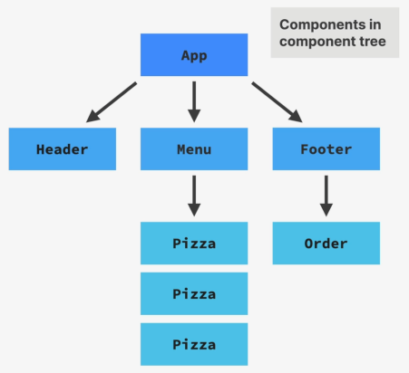
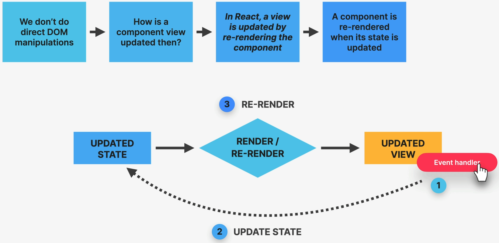
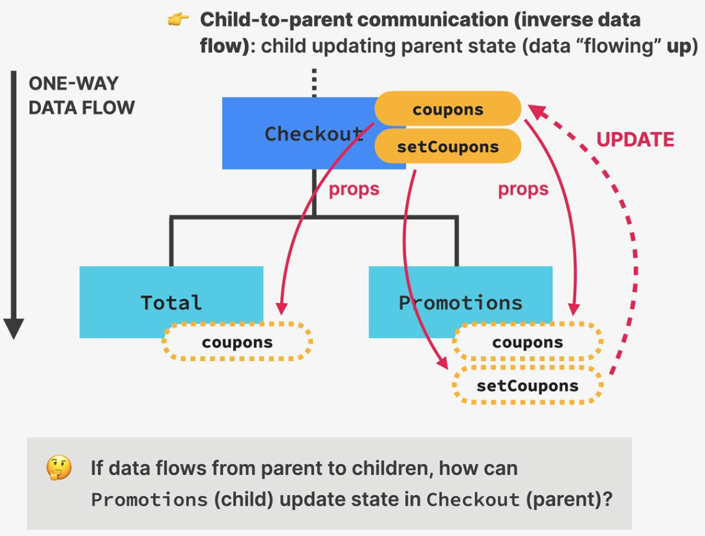

# The Ultimate React Course (2025)

## Section 5 : Working with Components, Props, and JSX

---

## 33. Rendering the Root Component and Strict Mode

```js
// Arquivo ./src/index.js
//React 18+

import React from "react";
import ReactDOM from "react-dom/client";

const App = () => {
  return <h1>Hello React!</h1>;
};

const root = ReactDOM.createRoot(document.getElementById("root"));
root.render(<App />);
```

- "index.js" é utilizado pelo WebPack, como sendo o ponto inicial do projeto. Por isso da necessidade de se criar esse arquivo, com esse nome.

- Os imports no início do arquivo, são as bibliotecas básicas necessárias para o projeto.

- A seguir, tem o componente App, dentro do qual será inserido o código da aplicação. O nome não precisa ser esse, mas o componente deve ser iniciado por letra maiúscula.

- É criada a variável root, a qual recebe a div de id *root* que está em *./public/index.html*. Será dentro dessa div que o React irá renderizar a aplicação.

- Posteriormente, é utilizado o método *render* , para renderizar a aplicação.

- Essa é a forma de renderizar a aplicação para o React 18+.

- No caso do React 17- o código seria:

```js
// Arquivo ./src/index.js

import React from "react";
import ReactDOM from "react-dom";

const App = () => {
  return <h1>Hello React!</h1>;
};

React.render(<App />, document.getElementById("root"));
```

- Ao invés de renderizar o *App* como um root component, pode-se utilizar o *strict mode* , simplesmente envolvendo o *App* em um *strict mode component*. Dessa forma, durante o desenvolvimento, o *strict mode* renderizará o componente duas vezes, a fim de verificar se existem bugs, e verificar se estão utilizadas versões ultrapassadas da

  *React API* .

```js
// Arquivo ./src/index.js
//React 18+

import React from "react";
import ReactDOM from "react-dom/client";

const App = () => {
  return <h1>Hello React!</h1>;
};

const root = ReactDOM.createRoot(document.getElementById("root"));
root.render(
  <React.StrictMode>
    <App />
  </React.StrictMode>
);
```

---

---

## 35 . Components as Building Blocks

- React applications are entirely made out of components.

- React renders a view for each component, and all those views toghther make up the UI.

- Each componente has it's own data, logic and appearence.

- Components can be reused, and nested inside other components.

---

---

## 36. Creating and Reusing a Component

- In React, we create components using functions.

- The function name has to start with an upper case letterr.

- The funciton must return some markup (ussualy in form of a jsx)

  ```react
  function Pizza() {
    return <h2>Pizza</h2>
  }
  ```

- For the component to be displayed in the screen, it should be used inside of the component wich is being redered on the screen.

  ```js
  // Arquivo ./src/index.js

  import React from "react";
  import ReactDOM from "react-dom/client";

  const App = () => {
    return <h1>Hello React!</h1> <Pizza />;
  };

  const root = ReactDOM.createRoot(document.getElementById("root"));
  root.render(
      <App />
  );
  ```

- Each component can only return one element. So, in order to avoid an error, the return of the App component shoul de encapsulated inside of a *div* .

- Once the *Pizza* component is nested inside *App* it will be presented on the screen. Pizza is nested inside of App.

- What should be nested is the component, and not it's declaration.

  ```js
  // Arquivo ./src/index.js

  import React from "react";
  import ReactDOM from "react-dom/client";

  const App = () => {
    return (
      <div>
        <h1>Hello React!</h1>
        <Pizza />
      </div>
    );
  };

  const root = ReactDOM.createRoot(document.getElementById("root"));
  root.render(<App />);
  ```

  - Below, more data is added to the pizza component. This data was copied from the file data.js

  ```typescript
  function Pizza() {
   return <div>
    
    <h2>Pizza Spinachi</h2>
    <p>Tomato, mozarella, spinach, and ricotta cheese</p>
   </div>
  }
  ```

- The most basic (and wrong) way of using a component, is just by manually copying it several times, into the *App*.

  ```typescript
  import React from "react";
  import ReactDOM from "react-dom/client";

  const App = () => {
    return (
      <div>
        <h1>Hello React!</h1>
        <Pizza />
        <Pizza />
        <Pizza />
      </div>
    );
  };
  ```

  ## 37. What is JSX

  

  - JSX is a declarative syntax to describre what components look like and how they work.
  - Every component must return one block of JSX, that React will use to render the compoent in the UI.

  

  - JSX is an extension of JavaScript that allows us to embed JS, CSS and React components into HTML.
  - JSX is declarative: it describes what the UI should look like using JSX, based on current data. JSX tells React **what** it should show on screen, and not **how** it should do it.

---

---

## 38. Creating more components

The components for the others structural elements from the page, will be created.

```jsx
//Header
const Header = () => {
  return <h1>Fast React Pizza Co. </h1>;
};
```

```jsx
//Menu
const Menu = () => {
  return (
    <div>
      <h2>Our Menu</h2>
      <Pizza />
      <Pizza />
      <Pizza />
    </div>
  );
};
```

```jsx
//Footer
const Footer = () => {
  return (
    <footer>{new Date().toLocalTimeString()}. We're currently open</footer>
  );
};
```

The *App* will be updated accordingly

```jsx
const App = () => {
  return (
    <div>
      <Header />
      <Menu />
      <Footer />
    </div>
  );
};
```

---

---

## 39. Styling React Applications

In JSX there are several ways of applying style to a component. One of them is
to use the inline style.

```javascript
const Header = () => {
  return <h1 style={{ color: red }}>Fast React Pizza Co.</h1>;
};
```

In JSX, in order to use the inline style it's necessary to pass the style
information inside of a javascript object ( the inner {}). And, to use JS,
is necessary to "enter in JS mode" (the outter {}). All the other style
information will be placed inside of the JS object.

```javascript
const Header = () => {
  return (
    <h1 style={{ color: red, fontSize: "32px", textTransform: "uppercase" }}>
      Fast React Pizza Co.
    </h1>
  );
};
```

Since it is all in a JS object, the style could also be informed like this

```javascript
const Header = () => {
  const style = { color: red, fontSize: "32px", textTransform: "uppercase" };

  return <h1 style={style}>Fast React Pizza Co.</h1>;
};
```

Another option is to use an external css file, define the style into classes,
and use the classe names where necessary. We should not foget to import the
CSS file, prior it's use.

```javascript
import "./index.css"; //just an example
```

---

---

## 42. Passing and receiveing Props

```javascript
const Menu = () => {
  return (
    <main className="menu">
      <h2>Our Menu</h2>
      {/*defining the props, and their value*/}
      <Pizza
        name="Pizza Spinaci"
        ingredients="Tomato,
      mozarella, spinach, and ricotta cheese"
        photoName="pizzas/spinaci.jpg"
        price="10"
      />
    </main>
  );
};

const Pizza = (props) => {
  //receiveing the props in the component
  return (
    <div>
       //using the props
      <h3>{props.name}</h3>
      <p>{props.ingredients}</p>
    </div>
  );
};
```

The props values don't have to be defined on the same order every time

```javascript
<Pizza
  name="Pizza Funghi"
  ingredients="Tomato, mushrooms"
  price="12"
  photoName="pizzas/funghi.jpg"
/>
```

---

---

## 43. Props, Immutability, and One-Way Data Flow

We use props to move data from a parent component to a child component

;

Props are like arguments passed to a JS function. Single values, arrays,
objects, functions and other components can be passed as props.

;

Props are read only. If you need to mutate props, it has to be done using State.a

Props are basically objects. And when you copy an object, and mutate a copy,
the original object will also be changed, afecting the behaviour of the parent
component, and/ or other child components.

;

It makes it easyer to predict the app behaviour, and debugg. Also, it's more
performant than a two way data flow.

---

---

## 44. CHALLENGE #1: Profile Card (v1)

Minha solução

```jsx
import { StrictMode } from "react";
import { createRoot } from "react-dom/client";
import "./styles.css";

function App() {
  return (
    <div className="card">
      <Avatar />
      <div className="data">
        <Intro />
        {/* Should contain one Skill component
        for each web dev skill that you have,
        customized with props */}
        <SkillList />
      </div>
    </div>
  );
}

const Avatar = () => {
  return (
    
  );
};

const Intro = () => {
  return (
    <div>
      <h1>Joelson Junior</h1>
      <p>
        Sou um profissional da área de TI, na qual atuo como desenvolvedor de
        software. Graças a minhas experiências passadas pude desenvolver
        competências que contribuem para minha área de atuação como por exemplo
        gestão de equipes, capacidade de solução de problemas, team building e
        capacidade de adaptação.
      </p>
    </div>
  );
};

const SkillList = () => {
  return (
    <div className="skill-list">
      <Skill skill="Ux" emoji="👶" color="blue" />
      <Skill skill="React" emoji="👶" color="orangered" />
      <Skill skill="C#" emoji="👶" color="purple" />
      <Skill skill="SQL" emoji="👶" color="gray" />
    </div>
  );
};

const Skill = (props) => {
  return (
    <div className="skill" style={{ backgroundColor: props.color }}>
      <span>{props.skill}</span>
      <span>{props.emoji}</span>
    </div>
  );
};

const rootElement = document.getElementById("root");
const root = createRoot(rootElement);

root.render(
  <StrictMode>
    <App />
  </StrictMode>
);
```

---

## 45. The Rules of JSX

---

### General Rules

- Essentialy works like HTML, but we can enter *JavaScript mode* by using {}
- We can place JavaScript expressions inside the {}. Examples: reference
  variables, create arrays or objects, [].map, ternary operator, etc.
- Statements are **not allowed** (if/ else, for, switch);
- JSX produces a JavaScript expression.

  ```javascript
  const el = <h1>Hello React!</h1>

  <!-- generates -->

  const el = React.createElement("h1", null, "Hello React!" );
  ```

- Because of that, we can:
  - place other pieces of JSX inside of the {}
  - write JSX anywhere inside a component ( in if/else, assign to variables,
    pass it to functions).
- A piece of JSX can have **one root element**. If you need more use
  <React.Fragment> (or the short <>

---

---

## 46. Rendering Lists)

In order to render list in React, we use the *map* method. With it we can go
over the data, and create a component to each one of them.

Right now, in order to render all the pizzas, we have to write one component
for each of the pizza items inside of the pizzaData array, and manually fill
the props for each one.

```jsx
const Menu = () => {
  return (
    <main className="menu">
      <h2>Our Menu</h2>
      {/*defining the props, and their value*/}
      <Pizza
        name="Pizza Spinaci"
        ingredients="Tomato,
      mozarella, spinach, and ricotta cheese"
        photoName="pizzas/spinaci.jpg"
        price="10"
      />
    </main>
  );
};

const Pizza = (props) => {
  //receiveing the props in the component
  return (
    <div>
       //using the props
      <h3>{props.name}</h3>
      <p>{props.ingredients}</p>
    </div>
  );
};
```

Using the map method, we ca iterate over the array, and generate (return) one
pizza component for each item of the array.

```jsx
<div>
  {pizzaData.map((pizza) => (
    <Pizza pizzaObject={pizza} key={pizza.name} />
  ))}
</div>
```

We pass the object to the component as a prop, and from inside the component,
retrieve the necessary data.

```jsx
const Pizza = (props) => {
  return (
    <div>
      
      <div>
        <h3>{props.pizzaObject.name}</h3>
        <p>{props.pizzaObject.ingredients}</p>
        <span>{props.pizzaObject.price}</span>
      </div>
    </div>
  );
};
```

As we are rendering a list, the div names should be changed, in order to be
semantically accurate. The final code will look like this:

```jsx
const Menu = () => {
  return (
    <main className="menu">
      <h2>Our Menu</h2>

      <ul className="pizzas">
        {pizzaData.map((pizza) => (
          <Pizza pizzaObject={pizza} key={pizza.name} />
        ))}
      </ul>
    </main>
  );
};

const Pizza = (props) => {
  return (
    <li className="pizza">
      
      <div>
        <h3>{props.pizzaObject.name}</h3>
        <p>{props.pizzaObject.ingredients}</p>
        <span>{props.pizzaObject.price}</span>
      </div>
    </li>
  );
};
```

**Note** : we should use .map, instead of forEach. The reason it that we need to
have *JSX* inside of the ul. Map returns a new array (JSX element).

---

---

## 47 Conditional Rendering with &&

```jsx
const Menu = () => {
  const pizzas = pizzaData;
  const havePizzas = pizzaData.length > 0;

  return (
    <main className="menu">
      <h2>Our Menu</h2>
      {havePizzas && (
        <ul className="pizzas">
          {pizzas.map((pizza) => (
            <Pizza pizzaObject={pizza} key={pizza.name} />
          ))}
        </ul>
      )}
```

---

## 48 Conditional Rendering with Ternaries

```jsx
  const Footer = () => {
  const hour = new Date().getHours();
  const openHour = 10;
  const closeHour = 22;
  const isOpen = hour >= openHour && hour <= closeHour;

  return (
    <footer className="footer">
      {isOpen ? (
        <div className="order">
          <p>We're open until {closeHour}:00. Come visit us, or order online</p>
          <buttton className="btn">Order</buttton>
        </div>
      ) : (
        <p>
          We're happy to welcome you between {openHour}:00 to {closeHour}:00.
        </p>
      )}
    </footer>
  );
};
```

---

## 49 Conditional Rendering with Multiple Returns

```jsx
const Pizza = (props) => {
  if (props.pizzaObject.soldOut) return null;

  return (
    <li className="pizza">
      
      <div>
        <h3>{props.pizzaObject.name}</h3>
        <p>{props.pizzaObject.ingredients}</p>
        <span>{props.pizzaObject.price}</span>
      </div>
    </li>
  );
};
```

---

## 50. Extracting JSX into a new Component

Spliting the Footer component in two separate components, Order and Footer.

```jsx
const Footer = () => {
  const hour = new Date().getHours();

  const businessHours = {
    open: 10,
    close: 13,
  };

  const isOpen = hour >= businessHours.open && hour <= businessHours.close;
return (
    <footer className="footer">
      {isOpen ? (
        <Order hours={businessHours} />
      ) : (
        <p>
          We're happy to welcome you between {businessHours.open}:00 and{" "}
          {businessHours.close}:00.
        </p>
      )}
    </footer>
  );
};

const Order = (props) => {
  return (
    <div className="order">
      <p>
        We're open until {props.hours.close}:00. Come visit us, or order online
      </p>
      <buttton className="btn">Order</buttton>
    </div>
  );
};

```

---

## 51. Destructuring Props

Using destructuring it's easyer to access the values that are passed using props.
The variable used in the destructuring of the props should have the same name of
the props being passed from the parent component.

```jsx

```

---

## 52. React Fragments

React Fragment allow us to group elements, without leaving any trace on the
HTML tree (in the DOM).

```jsx
  return (
    <main className="menu">
      <h2>Our Menu</h2>

      {havePizzas ? (
        <>
          <p>
            Authentic Italian cusine. 6 creative dishes to choose from. All from
            our stone oven, all organic, all delicious.
          </p>
          <ul className="pizzas">
            {pizzas.map((pizza) => (
              <Pizza pizzaObject={pizza} key={pizza.name} />
            ))}
          </ul>
        </>
      ) : (
        <p>We're still working on our menu. Please come back later.</p>
      )}
```

There are two ways of representin a React Fragment

```jsx
  <> </>

  <React.Fragment></React.Fragment>
```

The second way of doing it is usefeul when, for example, we're rendering a list,
and have the nedd to put a key to it.

```jsx
  <React.Fragment key={'my-sample-key'}>
  'some-code-here'
  </React.Fragment>
```

---

## 53. Setting Classes and Text Conditionally

```jsx
  const Pizza = ({ pizzaObject }) => {
  // if (pizzaObject.soldOut) return null;

  return (
    <li className={`pizza ${pizzaObject.soldOut ? "sold-out" : ""}`}>
      
      <div>
        <h3>{pizzaObject.name}</h3>
        <p>{pizzaObject.ingredients}</p>
        <span>{pizzaObject.soldOut ? "SOLD OUT" : pizzaObject.price}</span>
      </div>
    </li>
  );
};
```

---

## 54. Section Summary



---

## 57. Let's build a Steps Component

---

## 58. Handling Events the React Way

We specify a event listener function directly on the element were it will happen

```jsx
<div className="buttons">
    <div>
      <button
        style={{ backgroundColor: "#7950f2", color: "#FFF" }}
        onClick={() => alert("Previous")}
      >
        Previous
      </button>
    </div>
    <div>
      <button
        style={{ backgroundColor: "#7950f2", color: "#FFF" }}
        onClick={() => alert("Next")}
      >
        Next
      </button>
    </div>
  </div>
```

Event handler functions are written **right inside** the component

```jsx
export default function App() {
  const step = 3;

  const handlePrevious = () => {
    alert("Previous");
  };

  const handleNext = () => {
    alert("Next");
  };

  //The handlers are passed to the onClic, of each button.
  <div className="buttons">
        <div>
          <button
            style={{ backgroundColor: "#7950f2", color: "#FFF" }}
            onClick={handlePrevious}
          >
            Previous
          </button>
        </div>
        <div>
          <button
            style={{ backgroundColor: "#7950f2", color: "#FFF" }}
            onClick={handleNext}
          >
            Next
          </button>
        </div>
      </div>

```

---

## 59. What is State in React


- State is data that a component can hold over time. Necessary for information
that needs to be remenbered throughout the app's lifecycle.
- "Components' memory"
- **"State variable" / "piece of state"**: A single variable in a component
  (component state)
- State refers to the entire state that the component is in (the entire
  condition on a certain point in time). The term *State* refers to all the
  *pieces of state* toghether.
- Updating **component state** triggers *React* to **re-render the component**
- When a single component is rendered, we call it a view. All the views combined
  together make the final *User Interface*


- State is how *React* keeps data in sync with the UI
- State allow developers to:
  - Update the components view(by re-rendering it)
  - Persist local variables between renders

---

## 60. Creating a State Variable With useState

To utilize *State* in *React* we follow 3 basic steps:

- We add a new state variable
- We use it in the code (usually in JSX)
- We update the piece of state in some event handler

```jsx
import {useState} from React;

const arr = useState(1);
```

*useState* returns an array, with two values. The first is the default value of
that state. The second is a function that we can use to update our state
variable.

Usually, we should destruct the return of the useState. Doing so, we concluded
the first two steps necessary to use state.

```jsx
import { useState } from "react";

const messages = [
  "Learn React ⚛️",
  "Apply for jobs 💼",
  "Invest your new income 🤑",
];

export default function App() {
  //implementing State variable
  const [step, setStep] = useState(1);

  const handlePrevious = () => {
    alert("Previous");
  };

  const handleNext = () => {
    alert("Next");
  };

  return (
    <div className="steps">
      <div className="numbers">
      {/* using the State variable */}
        <div className={`${step >= 1 ? "active" : ""}`}>1</div>
        <div className={`${step >= 2 ? "active" : ""}`}>2</div>
        <div className={`${step >= 3 ? "active" : ""}`}>3</div>
      </div>
```

The next step is to update the state variable, using a handler.

```jsx
import { useState } from "react";

const messages = [
  "Learn React ⚛️",
  "Apply for jobs 💼",
  "Invest your new income 🤑",
];

export default function App() {
  const [step, setStep] = useState(1);

  const handlePrevious = () => {
    if (step > 1) setStep(step - 1);
  };

  const handleNext = () => {
    if (step < 3) setStep(step + 1);
  };

  return (
    <div className="steps">
      <div className="numbers">
        <div className={step >= 1 ? "active" : ""}>1</div>
        <div className={step >= 2 ? "active" : ""}>2</div>
        <div className={step >= 3 ? "active" : ""}>3</div>
      </div>
      <p className="message">
        Step {step}: {messages[step - 1]}
      </p>
      <div className="buttons">
        <div>
          <button
            style={{ backgroundColor: "#7950f2", color: "#FFF" }}
            onClick={handlePrevious}
          >
            Previous
          </button>
        </div>
        <div>
          <button
            style={{ backgroundColor: "#7950f2", color: "#FFF" }}
            onClick={handleNext}
          >
            Next
          </button>
        </div>
      </div>
    </div>
  );
}
```

- *useState* is a *React Hook*. All *React* functions that start with *use* are
hooks.
- Hooks can only be used on the top level of a function. Not inside an *if*
statment, functions, loops, etc.
- State should always be updated using the *update function*, and not manually.

---

## 61. Don't Set State Manually

```jsx
export default function App() {
  let [step, setStep] = useState(1);
  let [step, setStep] = useState(1);

  const handlePrevious = () => {
    // if (step > 1) setStep(step - 1);
    step = step +1;
  };
```

If we try to update a state variable manually, *React* won't have a way of
knowing that we're trying to update the state variable. Because of that, noting
happens.

- Always consider *state* in *React* as something immutable, and that can only
  be changed using the tolls provided by the framework.

---

## 62. The Mechanics of State



---

## 63. Adding Another Piece of State

```jsx
const handleIsOpen = () => {
    setIsOpen(!isOpen);
  };

  return (
    <>
      <button className="close" onClick={handleIsOpen}>
        &times;
      </button>
      {isOpen && (
        <div className="steps">
          <div className="numbers">
            <div className={step >= 1 ? "active" : ""}>1</div>
            <div className={step >= 2 ? "active" : ""}>2</div>
            <div className={step >= 3 ? "active" : ""}>3</div>
          </div>
          <p className="message">
            Step {step}: {messages[step - 1]}
          </p>
          <div className="buttons">
            <div>
              <button
                style={{ backgroundColor: "#7950f2", color: "#FFF" }}
                onClick={handlePrevious}
              >
                Previous
              </button>
            </div>
            <div>
              <button
                style={{ backgroundColor: "#7950f2", color: "#FFF" }}
                onClick={handleNext}
              >
                Next
              </button>
            </div>
          </div>
        </div>
      )}
    </>
  );
  ```

---

## 64. React Developer Tools

Allow us to inspect the component tree,  and manipulate components, (and it's states and props),
directly from the browser console.

---

## 65. Updating State Based on Current State

Update state, based on current state, in the way we're doing it it's fine, but
it's a fagrile solution.

```jsx
  const [step, setStep] = useState(1);

  const handleNext = () => {
    if (step < 3) setStep(step + 1);
  };
```

If we decide to increase two steps at a time, doing this:

```jsx
  const [step, setStep] = useState(1);

  const handleNext = () => {
    if (step < 3) {
      setStep(step + 1);
      setStep(step + 1);
    };
  };
```

It won't work. It will increase the steps by one.
The correct way of doing it, is to pass a callback function to the set function,
and provide to it the current value of the state.

```jsx
  const [step, setStep] = useState(1);

  const handleNext = () => {
    if (step < 3) {
      setStep((s) => s + 1);
      setStep((s) => s + 1);
    };
  };
```

Even if we're doing it only once, the safer way is to use the callback function,
when we're updating state, based on the current state.

```jsx
const handlePrevious = () => {
    if (step > 1) setStep((s) => s - 1);
  };

  const handleNext = () => {
    if (step < 3) setStep((s) => s + 1);
  };

  const handleIsOpen = () => {
    setIsOpen((is) => !is);
  };

```

There's no need for the callback, if we're not updating a state based on the
current state value.

---

## 66. More Thoughts About State + State Guidelines


- The UI is a representation of all the states, in all components. It's is
  basically a function of State
- A React application is about changing state over time, and displaying in
  correctly all the time.

### Practical Guidelines about State


---

## 72. Building a Form and Handling Submissions

To use a *Form* in *React* we use the regular *HTML* form

```jsx
  return (
    <form className="add-form">
      <h3>What do you need for your 😍 trip?</h3>
      <select>
        {Array.from({ length: 20 }, (_, i) => i + 1).map((num) => (
          <option value={num} key={num}>
            {num}
          </option>
        ))}
      </select>
      <input type="text" placeholder="Item..." />
      <button>Add</button>
    </form>
  );
};
```

The following piece of code is using an *Array* method, in order to
create a list of values, that will be passed on to the *map*, so it
can create an opton entry to each of the number in the *Array*

```jsx
      <select>
        {Array.from({ length: 20 }, (_, i) => i + 1).map((num) => (
          <option value={num} key={num}>
            {num}
          </option>
        ))}
      </select>
      <input type="text" 
```

To handle the form submission, we use a function handler, that shoul be
related to the form submit event it self, and not to the submission button.

```jsx
const Form = () => {
  const handleSubmit = () => {
   
  };

  return (
    <form className="add-form" onSubmit={handleSubmit}>
      <h3>What do you need for your 😍 trip?</h3>
      <select>
        {Array.from({ length: 20 }, (_, i) => i + 1).map((num) => (
          <option value={num} key={num}>
            {num}
          </option>
        ))}
      </select>
      <input type="text" placeholder="Item..." />
      <button>Add</button>
    </form>
  );
};
```

When we submit a form, the default HTML behaviour is to reload the page. In
order to keep the SPA flow, we don't want that to happen. So, we have to
pass the submit event to the handler, in order to prevent the default
behaviour. When the *submit* happens, React will pass the event to the
*onSubmit*  property (to the method that we wrote inside it). That event is an object with all the information of
the current event

```jsx
const Form = () => {
  const handleSubmit = (e) => {
    e.preventDefault();
  };

  return (
    <form className="add-form" onSubmit={handleSubmit}>
      <h3>What do you need for your 😍 trip?</h3>
      <select>
        {Array.from({ length: 20 }, (_, i) => i + 1).map((num) => (
          <option value={num} key={num}>
            {num}
          </option>
        ))}
      </select>
      <input type="text" placeholder="Item..." />
      <button>Add</button>
    </form>
  );
};
```

---

## 73. Controlled Elements

By default, the input elements maintain their own state inside the *DOM* (the HTML element itself). In *Reacrt* we like to
keep the *state* all in one place, wich is inside the application, and not inside the *DOM*. In order to do that, we use
a technique calle *controlled elements*. Doing so, is *React* that controls and own the state of the input field.

In order to use the controlled element technique, we follow 3 steps:

- First, we create a state.
- Second, we use that value.
- Third, connect the state with the value that will be typed on the input.

```jsx
const Form = () => {
  const [description, setDescription] = useState(""); //defining the state

  const handleSubmit = (e) => {
    e.preventDefault();
  };

  return (
    <form className="add-form" onSubmit={handleSubmit}>
      <h3>What do you need for your 😍 trip?</h3>
      <select>
        {Array.from({ length: 20 }, (_, i) => i + 1).map((num) => (
          <option value={num} key={num}>
            {num}
          </option>
        ))}
      </select>
      <input
        type="text"
        placeholder="Item..."
        value={description} //using the state value
        onChange={(e) => setDescription(e.target.value)} //connectig the inpute value with the state
      />
```

Controlling both inputs

```jsx
const Form = () => {
  const [description, setDescription] = useState("");
  const [quantity, setQuantity] = useState(1);

  const handleSubmit = (e) => {
    e.preventDefault();
  };

  return (
    <form className="add-form" onSubmit={handleSubmit}>
      <h3>What do you need for your 😍 trip?</h3>
      <select
        value={quantity}
        onChange={(e) => setQuantity(Number(e.target.value))}
      >
        {Array.from({ length: 20 }, (_, i) => i + 1).map((num) => (
          <option value={num} key={num}>
            {num}
          </option>
        ))}
      </select>
      <input
        type="text"
        placeholder="Item..."
        value={description}
        onChange={(e) => setDescription(e.target.value)}
      />
      <button>Add</button>
    </form>
  );
};
```

---

## 74. State vs. Props

| State | Props |
|:----: |:----: |
|Internal data, owned by component | External data, owned by the parent component|
|Component memory | Similar to function parameters |
|Can be update by the component itself | Read only |
|Updating State causes re-render | Receiveing new props, causes re-render. <br> Usually when the parent *State* is updated |
|Used to make components interactive | Used by parent component to configure child <br> component |

---

## 75. EXERCISE #1: Flashcards

---

## 76. CHALLENGE #2: Date Counter (v2)

---

## 78. What is "Thinking in React"?


### Thinking in React Process

1. Break the UI into components, and stabilsh the *component tree*
2. Build a static version in *React* (without *State*)
3. Think about *State*:
   1. When to use
   2. Types of *State*: local vs global
   3. Where to place each piece of *State*
4. Estabilish **data flow**:
   1. One-way data flow
   2. Child-to-parent communication
   3. Accessing global *State*


## 79. Fundamentals of State Management

**State management**: Deciding **when** to create pieces of state, what
**types** of state are necessary, **where** to place each piece of state, and
how data **flows** through the app.

| Local State | Global (Shared) State |
| :---------: | :----------: |
| Needed only by one or few components | Many components might need it |
| Acessed only by that components, and<br> it's child components | Accessible to every single component<br> in the entire app |
| Created with *useState* inside of a<br> certain component | Defined using *React Context API* or an external<br> state management library, as *Redux* |


It's recomended to start with a local state, and change it to global as needed.

### When and where to use State


## 80. Thinking About State and Lifting State Up

Lifting Up the state is moving it from the component, to the closest parent
component.

In the code below, we need to use the value of *items* of the *Form* component,
to the *PackingList* component, in order to render the list. But, we cannot use
*props* to pass the values, because *Form* isn't *PackingList*'s parent. 

```jsx
const Form = () => {
  const [description, setDescription] = useState("");
  const [quantity, setQuantity] = useState(1);
  const [items, setItems] = useState([]);

  const handleAddItem = (item) => {
    setItems((items) => [...items, item]);
  };

  const handleSubmit = (e) => {
    e.preventDefault();

    if (!description) {
      return;
    }

    const newItem = {
      id: Date.now(),
      description: description,
      quantity: quantity,
      packed: false,
    };

    handleAddItem(newItem);

    setDescription("");
    setQuantity(1);

    console.log(newItem);
  };

  return (
    <form className="add-form" onSubmit={handleSubmit}>
      <h3>What do you need for your 😍 trip?</h3>
      <select
        value={quantity}
        onChange={(e) => setQuantity(Number(e.target.value))}
      >
        {Array.from({ length: 20 }, (_, i) => i + 1).map((num) => (
          <option value={num} key={num}>
            {num}
          </option>
        ))}
      </select>
      <input
        type="text"
        placeholder="Item..."
        value={description}
        onChange={(e) => setDescription(e.target.value)}
      />
      <button>Add</button>
    </form>
  );
};

const PackingList = () => {
  return (
    <div className="list">
      <ul>
        {initialItems.map((item) => (
          <Item item={item} key={item.id} />
        ))}
      </ul>
    </div>
  );
};
```

In order to fix that, we need to *Lift up the State*, moving the *item* to a
Component whose is parent to it, and to *PackingList*, wich is the *App*
component.
We also move the handler function to the parent, keeping all the logic relative
to that state on the same component.

```jsx
export default function App() {

  const [items, setItems] = useState([]);

  const handleAddItem = (item) => {
    setItems((items) => [...items, item]);
  };

  return (
    <div className="app">
      <Logo />
      <Form onAddItems={handleAddItem}/> {/*prop name is a convention*/}
      <PackingList items={items}/>
      <Stats />
    </div>
  );
}
```

After that, we pass the *State* variable and the *setter function* down to the
others components as *props*

```jsx
export default function App() {

  const [items, setItems] = useState([]);

  setItems((items) => [...items, item]);
  };

  return (
    <div className="app">
      <Logo />
      <Form />
      <PackingList />
      <Stats />
    </div>
  );
}
```

Whenever multiple sibling components need to have access to the same state, we
move that state up, to the first common parent component

---

## 81. Reviewing "Lifting Up State"




---

## 82. Deleting an Item: More Child-to-Parent Communication

## 83. Updating an Item: Complex Immutable Data Operation

## 84. Derived State

It is *State* that is computed from another piece of *State* or from *props*

In the example below, instead of using 3 pieces of *State*, and having to update
the 3 of them simultaneously (wich would cause 3 re-renders), *cart* state is
used as **singel source of truth** for the related data.


That works because updating the *cart* will re-render the component, that
executes the function again, making that the values for numItems and totalPrice
to be recalculated.

---

## 85. Calculating Statistics as Derived State

## 86. Sorting Items

## 87. Clearing the List

## 88. Moving Components Into Separate Files

